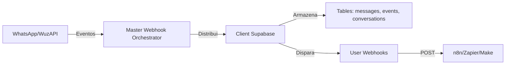

# Arquitetura de Webhooks WhatsApp CRM

## Visão Geral

A nova arquitetura de webhooks do WhatsApp CRM foi redesenhada para separar claramente as responsabilidades entre o sistema interno e as automações dos usuários.

## Fluxo de Dados



## Componentes Principais

### 1. Master Webhook Orchestrator (`whatsapp-orchestrator`)

**Localização:** `/supabase/functions/whatsapp-orchestrator/`

**Responsabilidades:**
- Recebe TODOS os eventos do WuzAPI
- Identifica a organização pelo `organization_id` na query string
- Busca credenciais do Client Supabase no Master
- Processa e armazena eventos nas tables apropriadas
- Dispara webhooks configurados pelo usuário

**Eventos Processados:**
- `Message` - Armazena em `whatsapp_messages`
- `ReadReceipt` - Atualiza status das mensagens
- `ChatPresence` - Armazena em `whatsapp_events`
- `HistorySync` - Armazena para processamento posterior

### 2. Backend WhatsApp Proxy

**Localização:** `/supabase/functions/whatsapp-proxy/`

**Mudanças Implementadas:**
- Auto-configura webhook para o orchestrator ao iniciar sessão
- Não expõe URL do orchestrator para o frontend
- Armazena configurações de webhook do usuário em `whatsapp_user_webhooks`

### 3. Frontend - Webhooks de Saída

**Localização:** `/src/components/features/WhatsAppCRM/components/WebhooksSettings.tsx`

**Mudanças:**
- Removido botão "Configurar Automático"
- Removido preenchimento automático com URL do master
- Interface simplificada para webhooks externos do usuário

### 4. Frontend - Webhooks de Automação

**Novo Componente:** `/src/components/features/WhatsAppCRM/components/UserWebhooksPanel.tsx`

**Funcionalidades:**
- Interface similar aos webhooks de automação n8n existentes
- Configuração de eventos específicos do WhatsApp
- Teste de webhooks com payload de exemplo
- Estatísticas de disparos (sucessos/falhas)

## Tables do Client Supabase

### Existentes (Atualizadas)
- `whatsapp_messages` - Adicionado `instance_id`
- `whatsapp_conversations` - Adicionados `last_message`, `unread_count`
- `whatsapp_contacts` - Adicionado `is_whatsapp`
- `whatsapp_events` - Armazena eventos de presença e histórico

### Nova
- `whatsapp_user_webhooks` - Configurações de webhook do usuário

## Tipos de Eventos para Usuário

### WhatsApp Events
- `whatsapp_message_received` - Mensagem recebida (IsFromMe = false)
- `whatsapp_message_sent` - Mensagem enviada (IsFromMe = true)
- `whatsapp_message_read` - Confirmação de leitura
- `whatsapp_presence` - Status de presença (digitando, online)
- `whatsapp_contact_created` - Novo contato criado
- `whatsapp_conversation_started` - Nova conversa iniciada

## Payload para Webhooks do Usuário

```json
{
  "event_type": "whatsapp_message_received",
  "timestamp": "2024-01-15T10:30:00Z",
  "organization_id": "uuid",
  "data": {
    "phone": "+5511999999999",
    "message": "Conteúdo da mensagem",
    "media_url": null,
    "is_from_me": false,
    "message_id": "MSG123",
    "raw_data": { /* Payload original do WuzAPI */ }
  }
}
```

## Segurança

1. **Isolamento:** Cada organização só recebe seus próprios eventos
2. **Autenticação:** Webhook do orchestrator valida `organization_id`
3. **Não exposição:** URL do orchestrator não é visível para usuários
4. **Rate Limiting:** Configurável por webhook do usuário

## Benefícios da Nova Arquitetura

1. **Separação de Responsabilidades:** Sistema interno vs automações do usuário
2. **Flexibilidade:** Usuários podem configurar múltiplos webhooks
3. **Confiabilidade:** Eventos sempre chegam ao sistema, independente de webhooks externos
4. **Escalabilidade:** Processamento centralizado permite otimizações futuras
5. **Auditoria:** Todos eventos são armazenados antes de serem enviados

## Migração

Para sistemas existentes:
1. Execute a migration `20250109_whatsapp_user_webhooks.sql`
2. Webhooks configurados anteriormente continuarão funcionando
3. Sistema auto-configura webhook do orchestrator na próxima conexão

## Próximos Passos

1. Implementar retry logic para webhooks falhos
2. Adicionar filtros avançados de eventos
3. Dashboard de analytics para webhooks
4. Suporte a transformação de payload (JSONPath)
5. Webhook condicional baseado em conteúdo da mensagem
