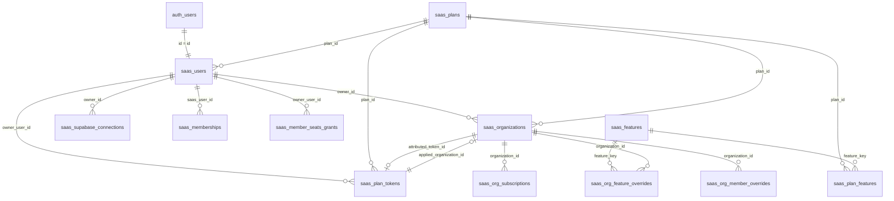

# Database Schema Doctrine — Tomik CRM

> **Versão:** 1.1.0  
> **Última atualização:** 28 Novembro 2025  
> **Classificação:** Documentação Normativa  
> **Changelog v1.1.0:** Adicionada Regra 2.1 (Validação de Service Role Key), Fluxo 6.4, DOCTRINE-006 após bug crítico de keys misturadas

---

## 📋 Índice

1. [Visão Geral da Arquitetura](#1-visão-geral-da-arquitetura)
2. [Arquitetura Multi-Tenant: Master vs Client](#2-arquitetura-multi-tenant-master-vs-client)
3. [Camadas de Dados](#3-camadas-de-dados)
4. [Tabelas do Master Supabase](#4-tabelas-do-master-supabase)
5. [Relacionamentos e Foreign Keys](#5-relacionamentos-e-foreign-keys)
6. [Fluxos de Dados](#6-fluxos-de-dados)
   - 6.4 [Fluxo de Salvamento de Service Role Key](#64-fluxo-de-salvamento-de-service-role-key-crítico) ⚠️ **CRÍTICO**
7. [Doutrina de Código](#7-doutrina-de-código)
   - 7.3.1 [Checklist para Credenciais](#731-checklist-específico-para-credenciais-supabase) ⚠️ **CRÍTICO**
8. [Glossário](#8-glossário)
9. [Validação Automática da Doutrina](#9-validação-automática-da-doutrina) ⚡ **LEIA ANTES DE COMMIT**
   - 9.1.1 [DOCTRINE-006: Validação de Service Role Key](#911-doctrine-006-validação-de-service-role-key) 🔴 **NOVO**

---

## 1. Visão Geral da Arquitetura

O Tomik CRM utiliza uma arquitetura **BYO Supabase (Bring Your Own Supabase)** que separa os dados em dois níveis:

```
┌─────────────────────────────────────────────────────────────────────┐
│                        MASTER SUPABASE                               │
│  (Controle de usuários, organizações, planos e conexões)            │
│                                                                      │
│  ┌─────────────┐  ┌─────────────────┐  ┌─────────────────────┐      │
│  │ saas_users  │  │ saas_organizations│ │ saas_supabase_     │      │
│  │ (Usuários)  │─▶│ (Propriedades)    │◀─│ connections        │      │
│  └─────────────┘  └─────────────────┘  │ (Repositório)       │      │
│         │                │              └─────────────────────┘      │
│         ▼                ▼                                           │
│  ┌─────────────┐  ┌─────────────────┐                               │
│  │saas_plan_   │  │ saas_memberships │                               │
│  │tokens       │  │ (Membros)        │                               │
│  └─────────────┘  └─────────────────┘                               │
└─────────────────────────────────────────────────────────────────────┘
                              │
                              │ client_org_id (vínculo)
                              ▼
┌─────────────────────────────────────────────────────────────────────┐
│                        CLIENT SUPABASE                               │
│  (Dados operacionais: leads, agendamentos, finanças, etc.)          │
│                                                                      │
│  ┌─────────────┐  ┌─────────────┐  ┌─────────────┐  ┌─────────────┐ │
│  │ organizations│  │  crm_leads  │  │appointments │  │  entradas   │ │
│  │(Controladora)│  │             │  │             │  │             │ │
│  └─────────────┘  └─────────────┘  └─────────────┘  └─────────────┘ │
└─────────────────────────────────────────────────────────────────────┘
```

### Princípios Fundamentais

1. **Separação de Responsabilidades**: O Master controla a "propriedade"; o Client controla os "dados operacionais"
2. **BYO Supabase**: Cada usuário traz seu próprio projeto Supabase para armazenar dados de sistema
3. **Isolamento por Organização**: Todos os dados no Client são isolados por `organization_id` via RLS

---

## 2. Arquitetura Multi-Tenant: Master vs Client

### 2.1 Master Supabase

O **Master Supabase** é o banco de dados centralizado do Tomik que gerencia:

| Responsabilidade | Descrição |
|-----------------|-----------|
| **Autenticação** | Login de usuários via `auth.users` |
| **Propriedades** | Organizações que pertencem a cada usuário |
| **Billing** | Planos, tokens de acesso e assinaturas |
| **Conexões** | Credenciais dos projetos Supabase dos clientes |
| **Permissões** | Membros e níveis de acesso às organizações |

### 2.2 Client Supabase

O **Client Supabase** é o projeto Supabase do próprio usuário que armazena:

| Responsabilidade | Descrição |
|-----------------|-----------|
| **CRM** | Leads, estágios do funil, atividades |
| **Agenda** | Agendamentos, eventos, calendário |
| **Financeiro** | Entradas, saídas, produtos/serviços |
| **Diretórios** | Clientes, colaboradores, profissionais |
| **Integrações** | Logs de webhook, interações de IA |

### 2.3 Relação Master ↔ Client

A ponte entre os dois mundos acontece através de duas colunas críticas:

```
saas_organizations (Master)
├── id                    ← ID da propriedade no Master
├── client_org_id         ← ID da organização no Client (VÍNCULO)
├── client_supabase_url   ← URL do projeto Supabase do cliente
└── client_service_key_encrypted ← Service Role criptografada
```

**⚠️ REGRA FUNDAMENTAL:**
- O `id` de `saas_organizations` é o identificador da **propriedade** no Master
- O `client_org_id` é o identificador da **organização controladora** no Client
- **Nunca use `saas_organizations.id` para filtrar dados no Client. Use sempre `client_org_id`.**

---

## 3. Camadas de Dados

### 3.1 Diagrama de Camadas

```
┌──────────────────────────────────────────────────────────────────────┐
│                     CAMADA 1: IDENTIDADE                              │
│  saas_users → O usuário autenticado (dono de recursos)               │
└──────────────────────────────────────────────────────────────────────┘
                                │
                    owner_id    │    owner_user_id
                                ▼
┌──────────────────────────────────────────────────────────────────────┐
│                     CAMADA 2: PROPRIEDADE                            │
│  saas_organizations    → Propriedade gerenciada pelo owner           │
│  saas_supabase_connections → Projetos Supabase do owner              │
│  saas_plan_tokens      → Tokens de plano do owner                    │
│  saas_member_seats_grants → Add-ons de assentos extra                │
└──────────────────────────────────────────────────────────────────────┘
                                │
         organization_id_in_client │ applied_organization_id
                                ▼
┌──────────────────────────────────────────────────────────────────────┐
│                     CAMADA 3: ACESSO                                 │
│  saas_memberships → Quem pode acessar quais organizações             │
│  saas_invitations → Convites pendentes                               │
└──────────────────────────────────────────────────────────────────────┘
                                │
                    plan_id     │    feature_key
                                ▼
┌──────────────────────────────────────────────────────────────────────┐
│                     CAMADA 4: PLANOS E FEATURES                      │
│  saas_plans        → Definição dos planos existentes                 │
│  saas_features     → Features disponíveis no sistema                 │
│  saas_plan_features → Valores de feature por plano                   │
└──────────────────────────────────────────────────────────────────────┘
```

### 3.2 Hierarquia de Ownership

```
saas_users.id
    │
    ├──▶ saas_organizations.owner_id (dono da propriedade)
    │
    ├──▶ saas_supabase_connections.owner_id (dono do projeto)
    │
    ├──▶ saas_plan_tokens.owner_user_id (dono do token)
    │
    └──▶ saas_member_seats_grants.owner_user_id (dono dos assentos)
```

**⚠️ REGRA:**
- Todo recurso tem um `owner_id` ou `owner_user_id` que referencia `saas_users.id`
- O owner sempre é um `saas_user`, nunca uma organização

---

## 4. Tabelas do Master Supabase

### 4.1 `saas_users` — Usuários SaaS

**Função:** Armazena usuários autenticados e suas propriedades de conta.

| Coluna | Tipo | Descrição |
|--------|------|-----------|
| `id` | uuid | PK, referencia `auth.users.id` |
| `email` | text | Email único do usuário |
| `role` | text | Role padrão: `'owner'` |
| `plan_id` | uuid | FK → `saas_plans.id` (legado, usar tokens) |
| `organization_id` | uuid | Organização atual selecionada |
| `trail_product_ids` | text | IDs de trilhas de estudo (comma-separated) |
| `member_seats_extra` | int | Assentos extras para convidar membros |
| `supabase_url` | text | **DEPRECADO** - Backup de URL |
| `supabase_key_encrypted` | text | **DEPRECADO** - Backup de chave |
| `service_role_encrypted` | text | **DEPRECADO** - Backup de service role |

**Add-ons controlados:**
- `trail_product_ids` → Trilhas de estudo adquiridas
- `member_seats_extra` → Assentos extras para membros

**⚠️ NOTA IMPORTANTE:**
As colunas `supabase_url`, `supabase_key_encrypted` e `service_role_encrypted` existem apenas para backup/migração. **NÃO USE ESSAS COLUNAS** para operações. Use `saas_organizations` ou `saas_supabase_connections`.

---

### 4.2 `saas_organizations` — Organizações (Propriedades)

**Função:** Representa uma "propriedade" no sistema - o container que agrupa dados.

| Coluna | Tipo | Descrição |
|--------|------|-----------|
| `id` | uuid | PK - ID da propriedade no Master |
| `name` | text | Nome da organização |
| `slug` | text | Slug único |
| `owner_id` | uuid | FK → `saas_users.id` (dono) |
| `client_org_id` | uuid | **CRÍTICO**: ID da org no Client Supabase |
| `client_supabase_url` | text | URL do projeto Supabase do cliente |
| `client_anon_key_encrypted` | text | Anon key criptografada |
| `client_service_key_encrypted` | text | Service role criptografada |
| `plan_id` | uuid | FK → `saas_plans.id` (plano atual) |
| `attributed_token_id` | uuid | FK → `saas_plan_tokens.id` (token ativo) |
| `trial_ends_at` | timestamptz | Fim do período trial |
| `member_seats_extra` | int | Assentos extras nesta org |

**Relacionamentos críticos:**
```
saas_organizations
    │
    ├── owner_id ──────────────▶ saas_users.id
    │
    ├── plan_id ───────────────▶ saas_plans.id
    │
    ├── attributed_token_id ───▶ saas_plan_tokens.id
    │
    └── client_org_id ─────────▶ organizations.id (NO CLIENT!)
```

**⚠️ REGRA DE VÍNCULO MASTER ↔ CLIENT:**
```
┌─────────────────────────────────────────────────────────────────────┐
│ saas_organizations.id ≠ organization_id usado no Client            │
│                                                                     │
│ O correto é: saas_organizations.client_org_id = organizations.id   │
│              (no Client Supabase)                                   │
└─────────────────────────────────────────────────────────────────────┘
```

---

### 4.3 `saas_memberships` — Membros de Organizações

**Função:** Define quem tem acesso a quais organizações e com quais permissões.

| Coluna | Tipo | Descrição |
|--------|------|-----------|
| `id` | uuid | PK |
| `saas_user_id` | uuid | FK → `saas_users.id` (membro) |
| `organization_id_in_client` | uuid | ID da org no Client (não é FK!) |
| `role` | text | `owner`, `admin`, `member`, `viewer` |
| `status` | text | `active`, `suspended` |
| `invited_by` | uuid | FK → `saas_users.id` (quem convidou) |
| `permissions_view` | jsonb | Permissões de visualização |
| `permissions_action` | jsonb | Permissões de ação |
| `supabase_url` | text | URL do Supabase (cache) |
| `service_role_encrypted` | text | Service role herdada da org |

**Hierarquia de Roles:**
```
owner  → Controle total, pode deletar organização
admin  → Gerencia membros, pode editar configurações
member → Acesso completo a dados operacionais
viewer → Apenas visualização
```

**⚠️ NOTA:**
`organization_id_in_client` NÃO é uma FK para `saas_organizations.id`. É o `client_org_id` que referencia a organização no Client Supabase.

---

### 4.4 `saas_plan_tokens` — Tokens de Plano

**Função:** Controla o acesso a planos através de tokens com validade.

| Coluna | Tipo | Descrição |
|--------|------|-----------|
| `id` | uuid | PK |
| `owner_user_id` | uuid | FK → `saas_users.id` (dono) |
| `plan_id` | uuid | FK → `saas_plans.id` (plano) |
| `status` | text | `available`, `redeemed`, `expired`, `canceled` |
| `valid_until` | timestamptz | Data de expiração |
| `applied_organization_id` | uuid | FK → `saas_organizations.id` (org aplicada) |
| `applied_at` | timestamptz | Quando foi aplicado |
| `is_frozen` | boolean | Token congelado? |
| `license_duration_days` | int | Duração em dias (para tokens frozen) |
| `gateway` | text | Gateway de pagamento |
| `external_order_id` | text | ID do pedido externo |

**Ciclo de vida do token:**
```
┌─────────────┐    ┌─────────────┐    ┌─────────────┐    ┌─────────────┐
│  available  │ ─▶ │  redeemed   │ ─▶ │  (em uso)   │ ─▶ │  expired    │
│             │    │             │    │             │    │             │
└─────────────┘    └─────────────┘    └─────────────┘    └─────────────┘
      │                                                        │
      └─────────────────── canceled ◀──────────────────────────┘
```

**Mecanismo de expiração:**
Quando um token expira, uma função/trigger no banco atualiza `saas_organizations.plan_id` para o plano free, até que um novo token válido seja atribuído via `attributed_token_id`.

---

### 4.5 `saas_plans` — Planos do Sistema

**Função:** Define os planos disponíveis e seus preços.

| Coluna | Tipo | Descrição |
|--------|------|-----------|
| `id` | uuid | PK |
| `name` | text | Nome do plano |
| `slug` | text | Slug único |
| `price_monthly` | numeric | Preço mensal |
| `price_yearly` | numeric | Preço anual |
| `features` | text[] | Features inclusas (legado) |
| `limits` | jsonb | Limites do plano |
| `max_members_per_org` | int | Máximo de membros |
| `active` | boolean | Plano ativo? |

---

### 4.6 `saas_plan_features` — Features por Plano

**Função:** Define o valor de cada feature para cada plano.

| Coluna | Tipo | Descrição |
|--------|------|-----------|
| `plan_id` | uuid | FK → `saas_plans.id` |
| `feature_key` | text | FK → `saas_features.key` |
| `value` | jsonb | Valor da feature |
| `enforced` | boolean | Feature deve ser enforçada? |

---

### 4.7 `saas_supabase_connections` — Repositório de Conexões

**Função:** Banco de projetos Supabase de propriedade de um usuário.

| Coluna | Tipo | Descrição |
|--------|------|-----------|
| `id` | uuid | PK |
| `owner_id` | uuid | FK → `saas_users.id` (dono) |
| `supabase_url` | text | URL do projeto |
| `anon_key_encrypted` | text | Anon key criptografada |
| `service_role_encrypted` | text | Service role criptografada |
| `label` | text | Nome/label da conexão |
| `project_ref` | text | Ref do projeto Supabase |
| `is_active` | boolean | Conexão ativa? |
| `last_used_at` | timestamptz | Último uso |

**Uso:**
```
┌─────────────────────────────────────────────────────────────────────┐
│ saas_supabase_connections é um REPOSITÓRIO de projetos Supabase    │
│                                                                     │
│ • Usado para leitura quando precisar puxar credenciais              │
│ • Usado para gerenciar/trocar projeto de uma organização            │
│ • Atua como backup de credenciais                                   │
│ • Apenas o owner_id pode gerenciar suas conexões                    │
└─────────────────────────────────────────────────────────────────────┘
```

---

## 5. Relacionamentos e Foreign Keys

### 5.1 Diagrama de Relacionamentos



### 5.2 Tabela de Foreign Keys

| Tabela Origem | Coluna | → | Tabela Destino | Coluna |
|---------------|--------|---|----------------|--------|
| `saas_users` | `id` | → | `auth.users` | `id` |
| `saas_users` | `plan_id` | → | `saas_plans` | `id` |
| `saas_organizations` | `owner_id` | → | `saas_users` | `id` |
| `saas_organizations` | `plan_id` | → | `saas_plans` | `id` |
| `saas_organizations` | `attributed_token_id` | → | `saas_plan_tokens` | `id` |
| `saas_memberships` | `saas_user_id` | → | `saas_users` | `id` |
| `saas_memberships` | `invited_by` | → | `saas_users` | `id` |
| `saas_plan_tokens` | `owner_user_id` | → | `saas_users` | `id` |
| `saas_plan_tokens` | `plan_id` | → | `saas_plans` | `id` |
| `saas_plan_tokens` | `applied_organization_id` | → | `saas_organizations` | `id` |
| `saas_supabase_connections` | `owner_id` | → | `saas_users` | `id` |
| `saas_plan_features` | `plan_id` | → | `saas_plans` | `id` |
| `saas_plan_features` | `feature_key` | → | `saas_features` | `key` |

---

## 6. Fluxos de Dados

### 6.1 Fluxo de Autenticação e Conexão

```
┌─────────────────────────────────────────────────────────────────────┐
│ 1. AUTENTICAÇÃO                                                      │
│    User login → auth.users → saas_users criado/atualizado           │
└──────────────────────────────┬──────────────────────────────────────┘
                               │
                               ▼
┌─────────────────────────────────────────────────────────────────────┐
│ 2. CARREGAMENTO DE ORGANIZAÇÕES                                      │
│    saas_users.organization_id → saas_organizations (org selecionada)│
│    saas_memberships.saas_user_id → Lista de orgs que tem acesso     │
└──────────────────────────────┬──────────────────────────────────────┘
                               │
                               ▼
┌─────────────────────────────────────────────────────────────────────┐
│ 3. CONEXÃO COM CLIENT SUPABASE                                       │
│    saas_organizations.client_supabase_url                           │
│    saas_organizations.client_service_key_encrypted (descriptografar)│
│    → supabaseManager.connectClient()                                │
└──────────────────────────────┬──────────────────────────────────────┘
                               │
                               ▼
┌─────────────────────────────────────────────────────────────────────┐
│ 4. ACESSO A DADOS NO CLIENT                                          │
│    Filtrar por organization_id = saas_organizations.client_org_id   │
│    RLS policies garantem isolamento                                 │
└─────────────────────────────────────────────────────────────────────┘
```

### 6.2 Fluxo de Atribuição de Token

```
┌─────────────────────────────────────────────────────────────────────┐
│ 1. COMPRA/PROVISÃO                                                   │
│    Webhook recebido → saas_plan_tokens criado                       │
│    status: 'available', owner_user_id: comprador                    │
└──────────────────────────────┬──────────────────────────────────────┘
                               │
                               ▼
┌─────────────────────────────────────────────────────────────────────┐
│ 2. ATRIBUIÇÃO                                                        │
│    User seleciona organização                                        │
│    saas_plan_tokens.applied_organization_id = org.id                │
│    saas_plan_tokens.status = 'redeemed'                             │
│    saas_organizations.attributed_token_id = token.id                │
│    saas_organizations.plan_id = token.plan_id                       │
└──────────────────────────────┬──────────────────────────────────────┘
                               │
                               ▼
┌─────────────────────────────────────────────────────────────────────┐
│ 3. EXPIRAÇÃO                                                         │
│    CRON/Trigger verifica valid_until                                │
│    Se expirado: status = 'expired'                                  │
│    saas_organizations.plan_id → free plan                           │
│    saas_organizations.attributed_token_id = NULL                    │
└─────────────────────────────────────────────────────────────────────┘
```

### 6.3 Fluxo de Convite de Membro

```
┌─────────────────────────────────────────────────────────────────────┐
│ 1. CRIAÇÃO DO CONVITE                                                │
│    Admin cria saas_invitations                                      │
│    email, organization_id_in_client, role, token                    │
└──────────────────────────────┬──────────────────────────────────────┘
                               │
                               ▼
┌─────────────────────────────────────────────────────────────────────┐
│ 2. ACEITE DO CONVITE                                                 │
│    User recebe email, clica no link                                 │
│    Se não tem conta: cria saas_users                                │
│    saas_invitations.status = 'accepted'                             │
│    saas_invitations.accepted_by = user.id                           │
└──────────────────────────────┬──────────────────────────────────────┘
                               │
                               ▼
┌─────────────────────────────────────────────────────────────────────┐
│ 3. CRIAÇÃO DO MEMBERSHIP                                             │
│    saas_memberships criado com:                                     │
│    - saas_user_id = user.id                                         │
│    - organization_id_in_client = convite.organization_id_in_client  │
│    - role = convite.role                                            │
│    - status = 'active'                                              │
│    - permissions_view/action herdados do role                       │
└─────────────────────────────────────────────────────────────────────┘
```

### 6.4 Fluxo de Salvamento de Service Role Key (CRÍTICO)

> ⚠️ Este fluxo foi documentado após o bug de nov/2025. Siga-o rigorosamente!

```
┌─────────────────────────────────────────────────────────────────────┐
│ 1. FRONTEND - Usuário cola a Service Role Key                       │
│    • MCPTools.tsx ou MCPIdentityTools.tsx                           │
│    • Extrai ref do JWT: payload.ref                                 │
│    • Extrai ref da URL: hostname.split('.')[0]                      │
│    • SE key.ref !== url.ref → toast.error() e PARA AQUI ❌          │
└──────────────────────────────┬──────────────────────────────────────┘
                               │ ✅ Refs coincidem
                               ▼
┌─────────────────────────────────────────────────────────────────────┐
│ 2. EDGE FUNCTION - save-service-role                                │
│    • Recebe: organization_id, service_role_key, supabase_url        │
│    • Valida NOVAMENTE: key.ref === url.ref                          │
│    • SE mismatch → return 400 { error: "Key mismatch..." } ❌       │
└──────────────────────────────┬──────────────────────────────────────┘
                               │ ✅ Validação passou
                               ▼
┌─────────────────────────────────────────────────────────────────────┐
│ 3. CRIPTOGRAFIA                                                      │
│    • Chama RPC encrypt_key() para criptografar a key                │
│    • Resultado: encrypted_service_role                              │
└──────────────────────────────┬──────────────────────────────────────┘
                               │
                               ▼
┌─────────────────────────────────────────────────────────────────────┐
│ 4. SALVAMENTO PRIMÁRIO - saas_organizations                         │
│    • UPDATE saas_organizations                                      │
│    • SET client_service_key_encrypted = encrypted                   │
│    • WHERE client_org_id = organizationId                           │
└──────────────────────────────┬──────────────────────────────────────┘
                               │
                               ▼
┌─────────────────────────────────────────────────────────────────────┐
│ 5. SINCRONIZAÇÃO - saas_supabases_connections                       │
│    • Valida MAIS UMA VEZ: key.ref === finalUrl.ref                  │
│    • SE mismatch → LOG ERROR e NÃO SINCRONIZA ❌                    │
│    • SE ok → UPSERT com onConflict: 'owner_id,supabase_url'         │
└─────────────────────────────────────────────────────────────────────┘
```

**Por que validar 3 vezes?**

```
┌─────────────────────────────────────────────────────────────────────┐
│  DEFESA EM PROFUNDIDADE (Defense in Depth)                          │
│                                                                      │
│  Camada 1: Frontend     → UX: Feedback imediato pro usuário         │
│  Camada 2: Edge Function → Segurança: Barreira no servidor          │
│  Camada 3: Sync Final    → Integridade: Última verificação          │
│                                                                      │
│  Se uma camada falhar, as outras ainda protegem o sistema.          │
└─────────────────────────────────────────────────────────────────────┘
```

---

## 7. Doutrina de Código

### 7.1 Regras Absolutas (NUNCA Violar)

#### Regra 1: Identificação de Organização no Client

```typescript
// ❌ ERRADO - Nunca use saas_organizations.id para filtrar no Client
const leads = await clientSupabase
  .from('crm_leads')
  .select('*')
  .eq('organization_id', saasOrganization.id) // ERRADO!

// ✅ CORRETO - Use sempre client_org_id
const leads = await clientSupabase
  .from('crm_leads')
  .select('*')
  .eq('organization_id', saasOrganization.client_org_id) // CORRETO!
```

#### Regra 2: Credenciais de Supabase

```typescript
// ❌ ERRADO - Ler credenciais de saas_users
const { supabase_url } = saasUser // DEPRECADO!

// ✅ CORRETO - Ler credenciais da organização ativa
const { client_supabase_url, client_service_key_encrypted } = saasOrganization

// ✅ CORRETO - Ler do repositório de conexões
const connections = await supabase
  .from('saas_supabase_connections')
  .select('*')
  .eq('owner_id', user.id)
```

#### Regra 2.1: Validação de Service Role Key (CRÍTICA)

> **⚠️ BUG HISTÓRICO:** Em novembro de 2025, um bug permitiu que a service_key de um projeto fosse salva em outro projeto, causando "Invalid API key" em produção. Esta regra foi criada para prevenir isso.

**SEMPRE valide que a key pertence ao projeto correto antes de salvar:**

```typescript
// ❌ ERRADO - Salvar key sem validar
await saveServiceRoleKey(organizationId, serviceRoleKey, supabaseUrl)

// ✅ CORRETO - Validar que a key pertence ao projeto
function extractProjectRefFromJwt(jwt: string): string | null {
  const payloadB64 = jwt.split('.')[1]
  const payload = JSON.parse(atob(payloadB64.replace(/-/g, '+').replace(/_/g, '/')))
  return payload?.ref || null
}

function extractProjectRefFromUrl(url: string): string | null {
  const hostname = new URL(url).hostname  // e.g., "abc123.supabase.co"
  return hostname.split('.')[0]           // e.g., "abc123"
}

// ANTES de salvar, comparar os refs
const keyRef = extractProjectRefFromJwt(serviceRoleKey)
const urlRef = extractProjectRefFromUrl(supabaseUrl)

if (keyRef !== urlRef) {
  throw new Error(`Key mismatch: key is for "${keyRef}" but URL is "${urlRef}"`)
}

// Só salvar se validação passou
await saveServiceRoleKey(organizationId, serviceRoleKey, supabaseUrl)
```

**Regras de validação de keys:**

| Cenário | Ação |
|---------|------|
| Key.ref === URL.ref | ✅ Permitir salvamento |
| Key.ref !== URL.ref | ❌ BLOQUEAR - Retornar erro claro |
| Não consegue extrair ref | ⚠️ Logar warning, permitir (legacy) |

**Onde aplicar:**
- Frontend: Validar antes de enviar ao servidor (feedback imediato)
- Edge Functions: Validar antes de criptografar e salvar
- Tenant Gateway: Validar antes de sincronizar para `saas_supabases_connections`

```
┌─────────────────────────────────────────────────────────────────────┐
│ FLUXO DE VALIDAÇÃO DE SERVICE ROLE KEY                              │
├─────────────────────────────────────────────────────────────────────┤
│                                                                      │
│  1. Frontend (MCPTools.tsx, MCPIdentityTools.tsx)                   │
│     └─ Extrai ref do JWT e compara com URL da organização           │
│     └─ Se mismatch: toast.error() e BLOQUEIA envio                  │
│                                                                      │
│  2. Edge Function (save-service-role)                               │
│     └─ Valida novamente (defesa em profundidade)                    │
│     └─ Se mismatch: return 400 com mensagem clara                   │
│     └─ Bloqueia sync para saas_supabases_connections                │
│                                                                      │
│  3. Tenant Gateway (routes/users.ts)                                │
│     └─ Valida antes de sincronizar credenciais                      │
│     └─ Se mismatch: loga erro e NÃO sincroniza                      │
│                                                                      │
└─────────────────────────────────────────────────────────────────────┘
```

#### Regra 3: Ownership de Recursos

```typescript
// Toda consulta de recursos owned DEVE filtrar por owner
const tokens = await supabase
  .from('saas_plan_tokens')
  .select('*')
  .eq('owner_user_id', user.id) // OBRIGATÓRIO

const connections = await supabase
  .from('saas_supabase_connections')
  .select('*')
  .eq('owner_id', user.id) // OBRIGATÓRIO
```

#### Regra 4: Verificação de Permissões

```typescript
// Antes de executar ação, verificar membership
const membership = await supabase
  .from('saas_memberships')
  .select('role, permissions_action')
  .eq('saas_user_id', user.id)
  .eq('organization_id_in_client', clientOrgId)
  .eq('status', 'active')
  .single()

if (!membership || !membership.permissions_action.canEdit) {
  throw new Error('Sem permissão')
}
```

### 7.2 Padrões de Acesso a Dados

#### Padrão: Leitura de Credenciais via Tenant Gateway

```typescript
// Use o Tenant Gateway para operações seguras
import { gatewayFetchUserCredentials } from '@/lib/tenant-gateway'

const credentials = await gatewayFetchUserCredentials()
// Retorna: { supabaseUrl, hasServiceRole, serviceRoleKey? }
```

#### Padrão: Conexão com Client Supabase

```typescript
import { supabaseManager } from '@/lib/supabase-manager'

// Conectar usando credenciais da organização
await supabaseManager.connectToClient({
  url: organization.client_supabase_url,
  anonKey: decrypted(organization.client_anon_key_encrypted),
  serviceRole: decrypted(organization.client_service_key_encrypted)
})

// Usar o client conectado
const client = supabaseManager.getClientSupabase()
```

### 7.3 Checklist de Implementação

Antes de implementar qualquer feature que acesse dados:

- [ ] Identificar se os dados são do Master ou Client
- [ ] Se Client: usar `client_org_id`, não `saas_organizations.id`
- [ ] Verificar ownership quando aplicável (`owner_id` / `owner_user_id`)
- [ ] Verificar membership e permissões se for ação em organização
- [ ] Nunca expor credenciais descriptografadas no client-side
- [ ] Usar Tenant Gateway para operações sensíveis
- [ ] Aplicar RLS policies consistentes

### 7.3.1 Checklist Específico para Credenciais Supabase

Antes de implementar qualquer código que salve/sincronize credenciais:

- [ ] **CRÍTICO**: Extrair `ref` do JWT e comparar com `project_ref` da URL
- [ ] Rejeitar salvamento se key.ref !== url.ref
- [ ] Implementar validação em TODAS as camadas (frontend, edge, gateway)
- [ ] Logar tentativas de salvamento com mismatch (para auditoria)
- [ ] Nunca sincronizar para `saas_supabases_connections` sem validar primeiro
- [ ] Usar mensagem de erro clara para o usuário: "Esta key é do projeto X, mas você está no projeto Y"

```
⚠️ LEMBRETE DO BUG DE NOV/2025:
Um usuário salvou a service_key do projeto "phpdqhmurfcftwqclqwg" 
enquanto estava na organização que usava "lwarydswfavmuzbccqmd".
O código sincronizou a key errada para a conexão, causando
"Invalid API key" em todas as Edge Functions daquela org.

CAUSA: Código não validava se a key pertencia ao projeto correto.
SOLUÇÃO: Sempre validar key.ref === url.ref antes de salvar.
```

### 7.4 Nomenclatura de Colunas

| Convenção | Uso |
|-----------|-----|
| `owner_id` | FK para `saas_users.id` (dono direto) |
| `owner_user_id` | FK para `saas_users.id` (em tabelas mais específicas) |
| `organization_id` | FK para organização no Client |
| `organization_id_in_client` | ID da org no Client (não FK no Master) |
| `*_encrypted` | Dados criptografados com pgcrypto |
| `*_at` | Timestamps |

---

## 8. Glossário

| Termo | Definição |
|-------|-----------|
| **Master Supabase** | Banco central que controla auth, billing e organizações |
| **Client Supabase** | Banco do cliente que armazena dados operacionais |
| **Propriedade** | Uma organização no Master (`saas_organizations`) |
| **Organização Controladora** | Organização no Client vinculada via `client_org_id` |
| **Owner** | Usuário dono de um recurso (org, token, conexão) |
| **Membership** | Relação de acesso de um usuário a uma organização |
| **Token de Plano** | Direito de uso de um plano, com validade |
| **BYO Supabase** | "Bring Your Own Supabase" - modelo onde cliente usa seu próprio projeto |
| **Tenant Gateway** | Camada segura para operações em dados de tenant |
| **RLS** | Row Level Security - políticas de isolamento por linha |
| **Project Ref** | Identificador único de um projeto Supabase (ex: `abc123xyz` em `abc123xyz.supabase.co`) |
| **Key Ref** | O `ref` contido no payload de um JWT Supabase (anon_key ou service_role) |
| **Key Mismatch** | Quando o ref da key não corresponde ao ref da URL do projeto - ERRO CRÍTICO |
| **Validação de Key** | Processo de extrair ref do JWT e comparar com ref da URL antes de salvar |

---

## 9. Validação Automática da Doutrina

### 🤖 Instruções para Agentes de IA

> **IMPORTANTE:** Ao ler este documento durante uma sessão de desenvolvimento, **SEMPRE execute os comandos de validação** antes de finalizar alterações no código.

```bash
# Rodar ANTES de commits para verificar conformidade
npm run doctrine:validate

# Para ver sugestões de correção
npm run doctrine:validate:fix

# Validação silenciosa para CI/CD (apenas exit code)
npm run ci:verify-doctrine
```

### 9.1 Por que Validar?

O validador automático (`scripts/validate-doctrine.mjs`) analisa o código fonte em busca de violações das regras desta doutrina. Ele detecta:

| Regra | Descrição | Severidade |
|-------|-----------|------------|
| DOCTRINE-002 | Leitura de credenciais deprecadas de `saas_users` | 🔴 Error |
| DOCTRINE-003 | Query a `saas_users` no Client Supabase | 🔴 Error |
| DOCTRINE-004 | Query sem filtro de `owner_id` | 🟡 Warning |
| DOCTRINE-005 | Uso de localStorage para credenciais | 🟡 Warning |
| DOCTRINE-006 | Salvamento de key sem validação de project_ref | 🔴 Error |

> **Nota:** DOCTRINE-001 (uso de `organization_id`) está desabilitada temporariamente pois requer refatoração ampla do frontend.

### 9.1.1 DOCTRINE-006: Validação de Service Role Key

Esta regra foi adicionada após um bug crítico em novembro/2025 onde uma service_key foi salva no projeto errado.

**O que detecta:**
- Código que salva `service_role_encrypted` ou `client_service_key_encrypted` sem chamar `validateKeyBelongsToProject()` ou equivalente
- Upserts em `saas_supabases_connections` sem validação prévia do ref
- Chamadas a RPCs de encrypt_key sem validação

**Padrão correto:**
```typescript
// ✅ CORRETO - Validar ANTES de criptografar/salvar
const validation = validateKeyBelongsToProject(key, supabaseUrl)
if (!validation.valid) {
  throw new Error(`Key mismatch: ${validation.keyRef} vs ${validation.urlRef}`)
}
// Só então criptografar e salvar
const encrypted = await encrypt(key)
await saveToDb(encrypted)
```

**Arquivos que DEVEM implementar esta validação:**
- `supabase/functions/save-service-role/index.ts`
- `apps/tenant-gateway/src/routes/users.ts`
- Qualquer código que manipule `*_service_key_encrypted` ou `service_role_encrypted`

### 9.2 Como Funciona

O validador usa **análise estática com regex** para detectar padrões problemáticos:

```
┌─────────────────────────────────────────────────────────────┐
│  1. COLETA - Busca arquivos .ts/.tsx/.js/.jsx               │
│     src/**, apps/**, supabase/functions/**                  │
└─────────────────────────────────────────────────────────────┘
                            ↓
┌─────────────────────────────────────────────────────────────┐
│  2. ANÁLISE - Aplica regex de cada regra em cada arquivo    │
│     Verifica lista de ignores por regra                     │
└─────────────────────────────────────────────────────────────┘
                            ↓
┌─────────────────────────────────────────────────────────────┐
│  3. RELATÓRIO - Lista violações com arquivo:linha:coluna    │
│     Exit code 0 = passou, 1 = tem erros                     │
└─────────────────────────────────────────────────────────────┘
```

### 9.3 Evitando Falsos Positivos

O validador tem **listas de ignore** para arquivos que legitimamente precisam de exceções:

#### Arquivos Ignorados por Design

| Padrão | Motivo |
|--------|--------|
| `**/tenant-gateway/**` | Backend com autenticação própria |
| `**/functions/admin-*` | Edge functions administrativas |
| `**/functions/saas-*` | Funções que gerenciam dados SaaS |
| `**/SupabaseAutoUpdater*` | Usa fallback após verificar saas_organizations |
| `**/lib/supabase.ts` | Código legado documentado mantido para compatibilidade |

#### Se Encontrar um Falso Positivo

1. **Verifique se é realmente falso positivo** - O código pode estar errado mesmo
2. **Se for legítimo**, adicione o arquivo ao ignore da regra em `scripts/validate-doctrine.mjs`:

```javascript
// Em RULES, na regra específica:
ignore: [
  '**/MeuArquivoLegitimo*',  // Adicionar aqui com comentário explicando
]
```

3. **Documente o motivo** - Explique por que o código precisa da exceção

### 9.4 Integração com CI/CD

Recomenda-se adicionar ao pipeline de CI:

```yaml
jobs:
  lint:
    steps:
      - name: Validate Database Doctrine
        run: npm run ci:verify-doctrine
```

O script retorna:
- **Exit 0**: Nenhum erro (warnings são permitidos)
- **Exit 1**: Há erros que precisam ser corrigidos

### 9.5 Fluxo de Trabalho Recomendado

```
┌─────────────────────────────────────────────────────────────┐
│  1. Antes de começar: Ler esta doutrina                     │
└─────────────────────────────────────────────────────────────┘
                            ↓
┌─────────────────────────────────────────────────────────────┐
│  2. Durante desenvolvimento: Seguir as regras §7            │
└─────────────────────────────────────────────────────────────┘
                            ↓
┌─────────────────────────────────────────────────────────────┐
│  3. Antes de commit: npm run doctrine:validate              │
└─────────────────────────────────────────────────────────────┘
                            ↓
┌─────────────────────────────────────────────────────────────┐
│  4. Se houver erros: Corrigir e validar novamente           │
└─────────────────────────────────────────────────────────────┘
                            ↓
┌─────────────────────────────────────────────────────────────┐
│  5. Commit e push: CI/CD valida automaticamente             │
└─────────────────────────────────────────────────────────────┘
```

---

## 📚 Documentos Relacionados

- [Arquitetura Geral](./current-architecture.md)
- [Fluxos de Dados](./data-flows.md)
- [Tenant Gateway Security](../BLUEPRINT-TENANT-GATEWAY-SECURITY.md)
- [Master-Client Setup](../MASTER-CLIENT-SUPABASE.md)
- [Security](../SECURITY.md)

---

**Mantido por:** Engineering Team  
**Classificação:** Documentação Normativa — Todo código deve aderir a esta doutrina.

