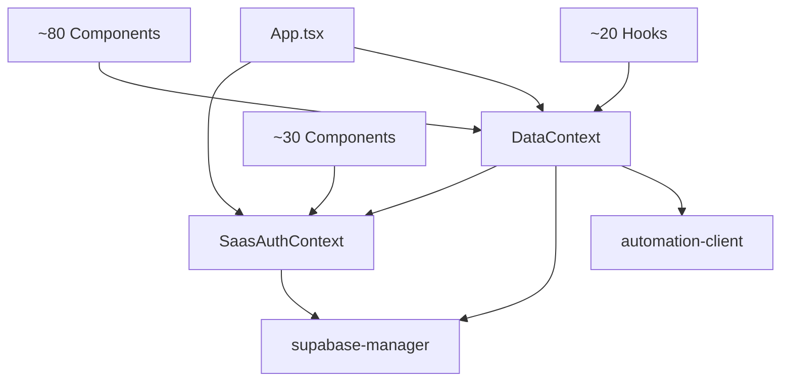

# Quick Reference - Arquitetura TomikCRM

> Guia rápido para navegação da arquitetura

---

## 🎯 Links Rápidos

- 📊 [Arquitetura Completa](./current-architecture.md)
- 🔄 [Fluxos de Dados](./data-flows.md)
- 🚀 [Roadmap de Refatoração](./refactoring-roadmap.md)

---

## 🔴 Arquivos Críticos (Requerem Refatoração Urgente)

| Arquivo | LOC | Problemas | Prioridade |
|---------|-----|-----------|------------|
| `App.tsx` | 1039 | God Object, 8+ responsabilidades | 🔴 ALTA |
| `DataContext.tsx` | 1389 | Contexto monolítico (7 entidades) | 🔴 ALTA |
| `SaasAuthContext.tsx` | 1278 | Mistura auth + billing + conexões | 🔴 ALTA |
| `supabase-manager.ts` | 800 | Singleton, 11 fallbacks | 🟠 MÉDIA |

---

## 📁 Estrutura de Pastas

```
src/
├── App.tsx ⚠️ 1039 linhas
├── main.tsx
│
├── components/
│   ├── features/ (145 arquivos)
│   │   ├── Agenda/ ✅
│   │   ├── Auth/ ⚠️
│   │   ├── Kanban/ ⚠️
│   │   └── ...
│   ├── layout/ (6 arquivos) ✅
│   ├── system/ (4 arquivos) ✅
│   └── ui/ (27 arquivos) ✅
│
├── context/ ⚠️ Principais problemas aqui
│   ├── SaasAuthContext.tsx (1278 linhas) 🔴
│   ├── DataContext.tsx (1389 linhas) 🔴
│   ├── NotificationContext.tsx ✅
│   └── AuthContext.tsx (deprecated)
│
├── hooks/ (32 arquivos)
│   ├── useKanbanLeads.ts ⚠️ 359 linhas
│   ├── useDebounce.ts ✅
│   └── ...
│
├── lib/ ⚠️ Singleton anti-patterns
│   ├── supabase-manager.ts (800 linhas) 🟠
│   ├── automation-client.ts (489 linhas) ✅
│   ├── analytics.ts ✅
│   └── ...
│
├── services/
│   ├── whatsapp-validator.ts ✅
│   └── whatsapp-validator-simple.ts
│
└── types/ ✅
```

---

## 🔄 Principais Fluxos

### 1. Autenticação (SaaS Multi-Tenant)

```
LoginForm
  → SaasAuthContext.signIn()
  → Master Supabase (Auth)
  → Load user profile
  → Check token expiry
  → Reconnect Client Supabase
  → App.tsx renders Dashboard
```

**Problema:** 11 estratégias de fallback para carregar credenciais

---

### 2. CRUD de Leads

```
KanbanBoard
  → useKanbanLeads.createLead()
  → DataContext.addLead()
  → Validação inline (phone, stage)
  → Cálculo de preço inline
  → Client Supabase RPC
  → Webhook dispatch (síncrono!) ⚠️
  → WhatsApp validation (background)
```

**Problema:** Lógica de negócio misturada com estado

---

### 3. Drag & Drop no Kanban

```
User drags card
  → Optimistic UI update (instant) ✅
  → moveLeadToStage()
  → UPDATE crm_leads (background)
  → Realtime broadcast to other users
```

**Boa prática:** Optimistic update para UX responsivo

---

## 🎨 Padrões de Design

### ✅ O que está BOM

```typescript
// 1. Hooks simples e reutilizáveis
export const useDebounce = <T>(value: T, delay: number): T => {
  const [debouncedValue, setDebouncedValue] = useState(value)
  // ... implementação limpa
  return debouncedValue
}

// 2. Componentes UI puros
export const Button = ({ children, onClick, variant }: ButtonProps) => (
  <button className={cn(variants[variant])} onClick={onClick}>
    {children}
  </button>
)

// 3. Services com interface clara
export class WhatsAppValidator {
  async checkWhatsApp(phone: string): Promise<ValidationResult> {
    // ... lógica isolada
  }
}
```

### ❌ O que está RUIM

```typescript
// 1. Contexto monolítico
export const DataProvider = ({ children }) => {
  // Gerencia 7 entidades diferentes!
  const [patients, setPatients] = useState([])
  const [professionals, setProfessionals] = useState([])
  const [appointments, setAppointments] = useState([])
  // ... 1300+ linhas
}

// 2. Lógica de negócio inline
const addLead = async (data) => {
  // Validação inline
  data.whatsapp = normalizePhoneE164BR(data.whatsapp)
  
  // Cálculo inline
  if (data.sold_produto_servico_id) {
    const price = await getPrice(data.sold_produto_servico_id)
    data.payment_value = price * data.quantity
  }
  
  // CRUD inline
  const result = await supabase.from('crm_leads').insert(data)
  
  // Webhook inline (síncrono!)
  await sendWebhook('lead_created', result)
  
  return result
}

// 3. Singleton global
class SupabaseManager {
  private connections = new Map() // Estado global mutável
  
  getClientSupabase() {
    return this.connections.get(this.currentOrganizationId)
  }
}

export const supabaseManager = new SupabaseManager() // Anti-pattern
```

---

## 🚀 Primeiros Passos para Melhorar

### Esta Semana

1. **Setup de Testes**
   ```bash
   npm install -D vitest @testing-library/react
   ```
   
2. **Criar primeiros testes**
   ```typescript
   // src/test/utils.test.ts
   describe('normalizePhoneE164BR', () => {
     it('should normalize Brazilian phone', () => {
       expect(normalizePhoneE164BR('11999999999')).toBe('+5511999999999')
     })
   })
   ```

3. **Extrair AppRouter**
   - Criar `src/routing/AppRouter.tsx`
   - Mover lógica de tabs para hook `useActiveTab`
   - Reduzir App.tsx para < 400 linhas

---

### Este Mês

1. **Extrair MigrationService**
   - Criar `src/services/migration/MigrationService.ts`
   - Mover 38 imports SQL para arquivo separado
   - Reduzir App.tsx em ~600 linhas

2. **Criar LeadsProvider**
   - `src/features/leads/context/LeadsProvider.tsx`
   - `src/features/leads/repositories/LeadsRepository.ts`
   - `src/features/leads/services/LeadValidator.ts`
   - `src/features/leads/services/PricingService.ts`

3. **Aumentar coverage para 30%**

---

## 📊 Métricas de Progresso

### Baseline (Hoje)

- ✅ Arquitetura documentada
- ❌ Coverage: 0%
- ❌ Maintainability: 25/100
- ❌ LOC em 3 arquivos: 3706 (14.7% do total)

### Meta (3 meses)

- ✅ Coverage: 70%
- ✅ Maintainability: 75/100
- ✅ LOC em arquivos críticos: < 1000 (redução de 73%)
- ✅ Re-renders: -90%

---

## 🔗 Dependências Principais



**Problema:** Dependências circulares e alto acoplamento

---

## 🎯 Decisões de Design

### Por que Context API ao invés de Redux/Zustand?

✅ **Prós:**
- Nativo do React
- Zero deps externas
- Simples para equipe pequena

❌ **Contras:**
- Re-renders desnecessários (contextos monolíticos)
- Dificulta testes
- Sem devtools nativos

**Solução:** Quebrar em contextos menores + usar React.memo

---

### Por que Supabase e não custom backend?

✅ **Prós:**
- Velocidade de desenvolvimento
- Realtime built-in
- Auth + DB + Storage em um lugar
- RLS para multi-tenancy

❌ **Contras:**
- Vendor lock-in
- Complexidade em queries avançadas
- Migrações SQL manuais

**Solução:** Repository Pattern para abstrair acesso a dados

---

## 📚 Recursos Úteis

### Documentação Interna

- [Arquitetura Completa](./current-architecture.md) - Análise detalhada
- [Fluxos de Dados](./data-flows.md) - Diagramas de sequência
- [Roadmap](./refactoring-roadmap.md) - Plano de refatoração

### Links Externos

- [React Context Best Practices](https://kentcdodds.com/blog/how-to-use-react-context-effectively)
- [Repository Pattern in TypeScript](https://blog.logrocket.com/implement-repository-pattern-typescript/)
- [Testing React Apps](https://testing-library.com/docs/react-testing-library/intro/)
- [Supabase Multi-Tenancy](https://supabase.com/docs/guides/auth/row-level-security)

---

## 🆘 Precisa de Ajuda?

### Perguntas Frequentes

**Q: Por que App.tsx está tão grande?**
A: Acúmulo de features ao longo do tempo sem refatoração.

**Q: Como testar componentes que usam DataContext?**
A: Criar wrapper de teste com provider mockado.

**Q: Posso remover código antigo imediatamente?**
A: Não! Use feature flags e remova após 2 sprints de estabilidade.

**Q: Como decidir o que refatorar primeiro?**
A: Priorize por: 1) LOC, 2) Frequência de bugs, 3) Impacto em performance

---

## 📝 Checklist de Code Review

Antes de aprovar PR de refatoração:

- [ ] Testes adicionados/atualizados
- [ ] Coverage não diminuiu
- [ ] Performance não degradou (benchmarks)
- [ ] Documentação atualizada
- [ ] Linter sem erros
- [ ] Funcionalidade existente funcionando
- [ ] Rollback plan definido

---

**Última atualização:** 31 de Outubro de 2025  
**Mantido por:** Engineering Team

