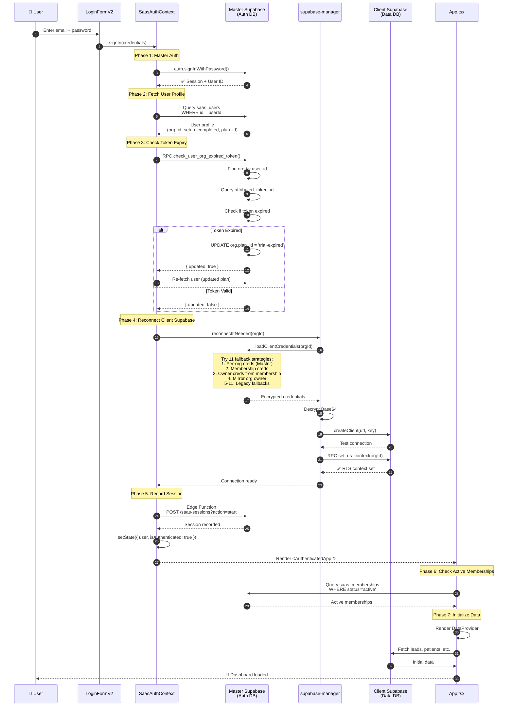
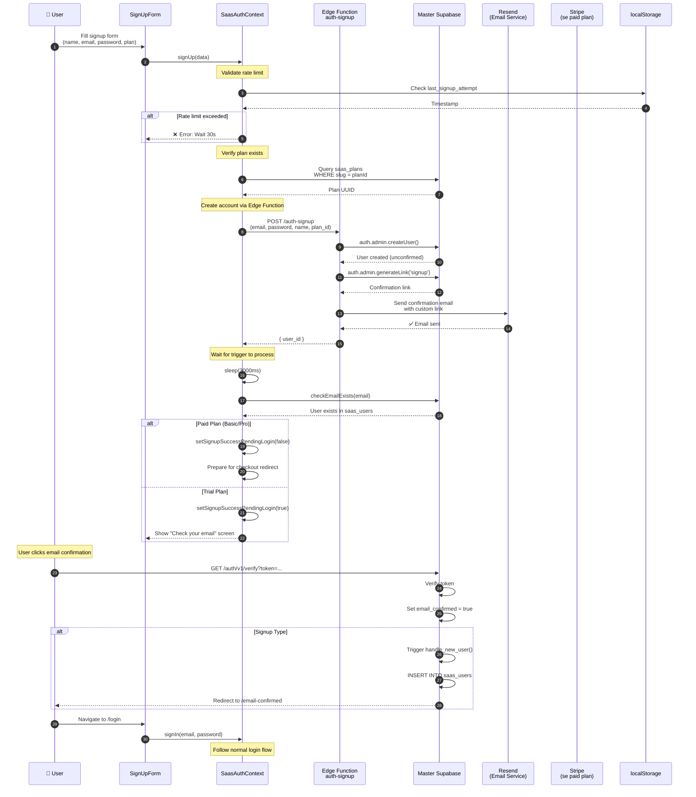
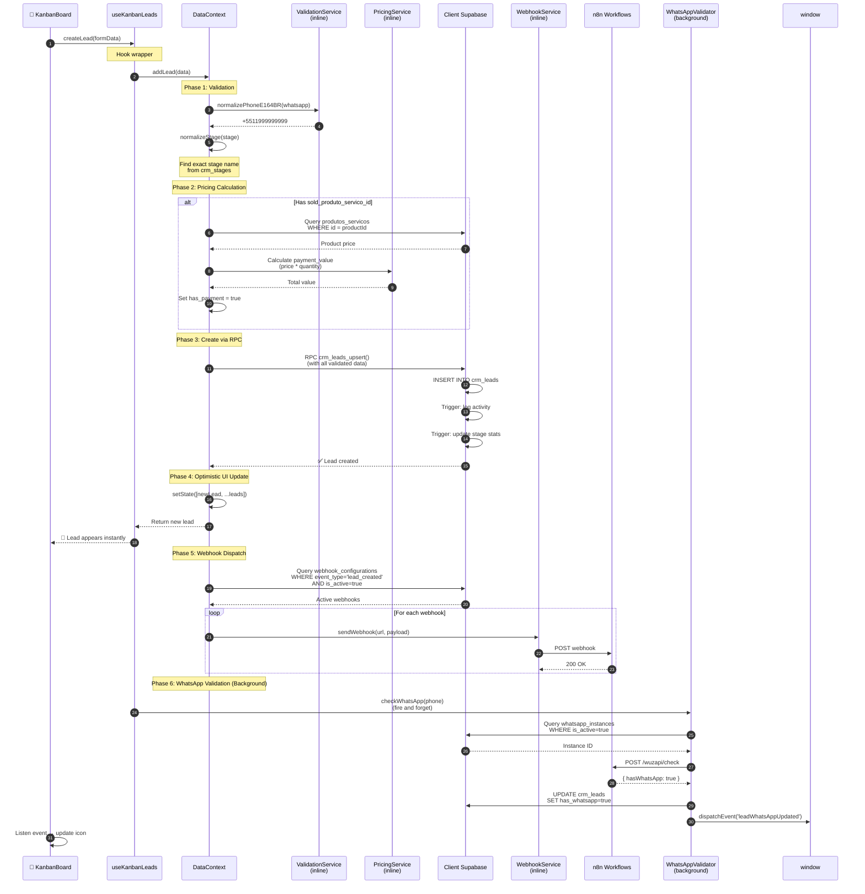
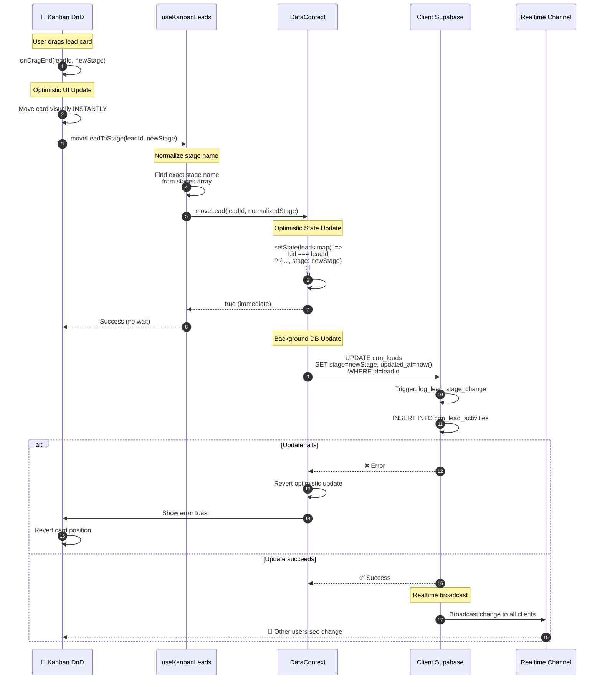
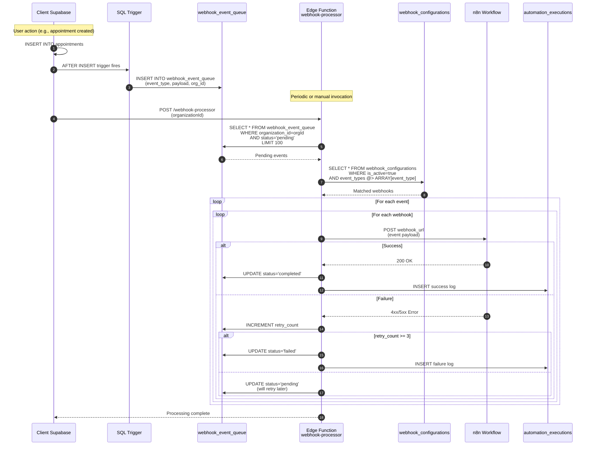
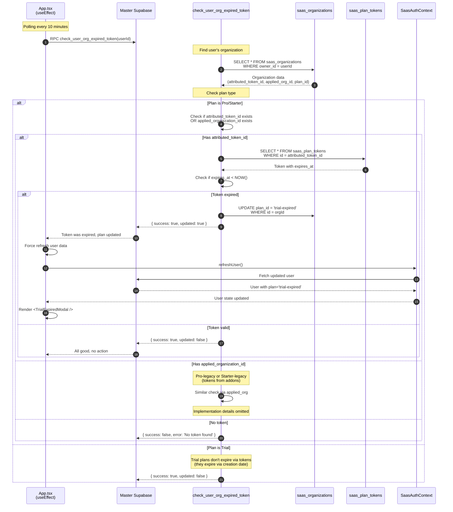
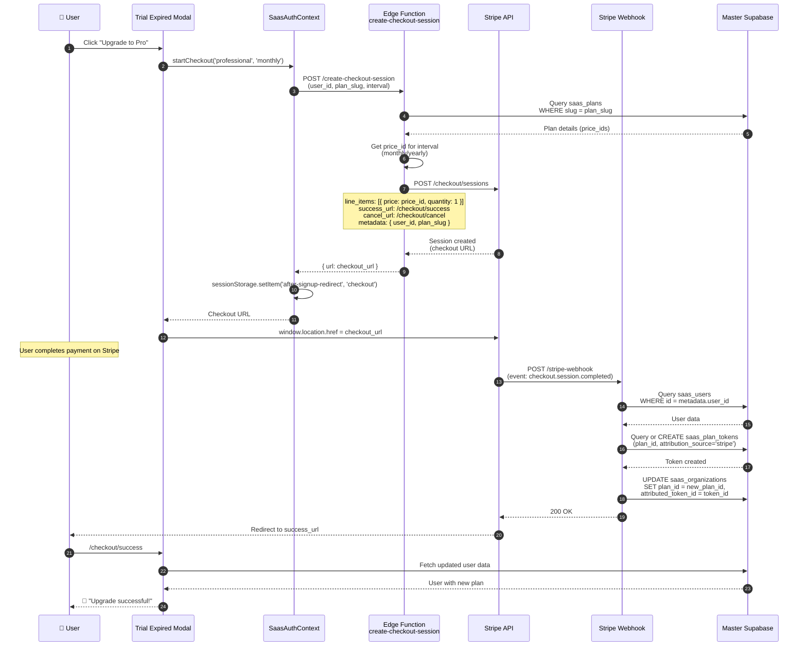
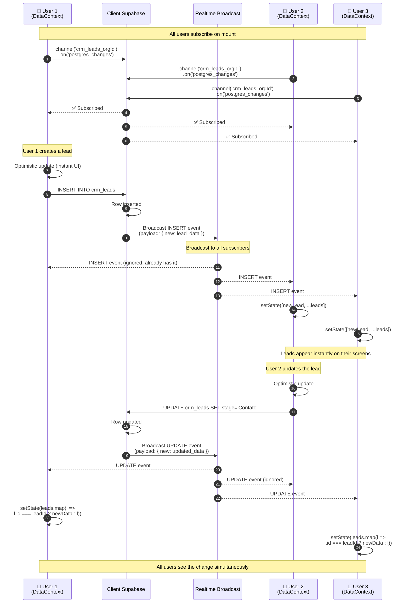
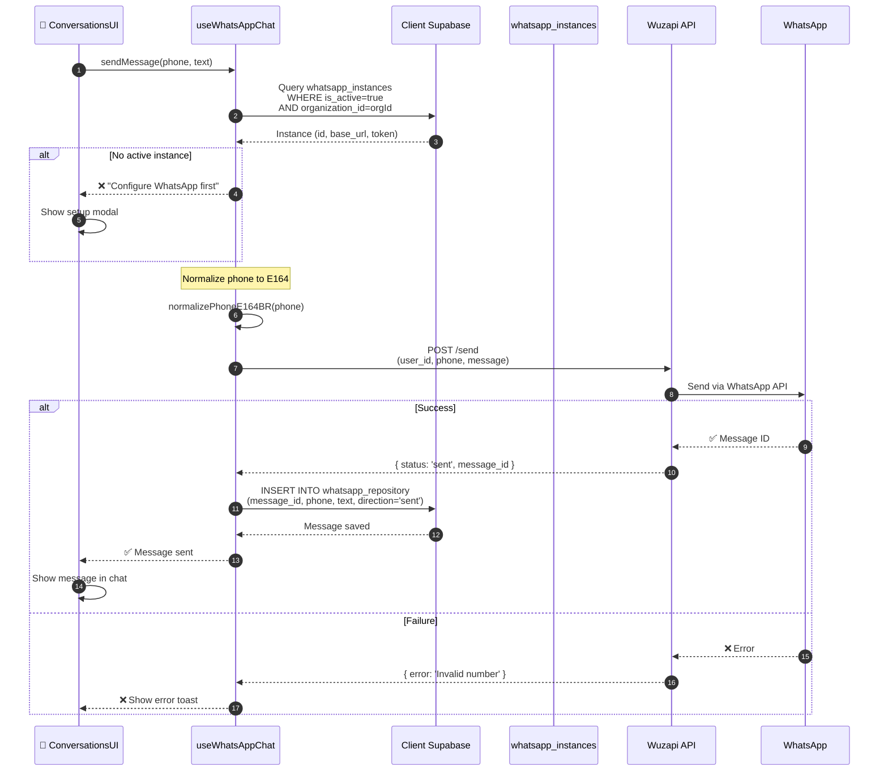

# Fluxos de Dados - TomikCRM

> Documentação detalhada dos principais fluxos de dados na aplicação

---

## Índice

1. [Fluxos de Autenticação](#fluxos-de-autenticação)
2. [Fluxos de Dados (CRUD)](#fluxos-de-dados-crud)
3. [Fluxos de Automação](#fluxos-de-automação)
4. [Fluxos de Billing](#fluxos-de-billing)
5. [Fluxos de Realtime](#fluxos-de-realtime)
6. [Fluxos de WhatsApp](#fluxos-de-whatsapp)

---

## Fluxos de Autenticação

### 1. Login Flow (SaaS Multi-Tenant)

**Pontos críticos identificados:**

1. 🔴 **11 estratégias de fallback** (lines SM→MS): Lógica complexa demais, dificulta debug
2. 🔴 **Token check no client**: Deveria ser server-side guard
3. 🟠 **Criptografia Base64**: Não é criptografia real, apenas encoding
4. 🟠 **Reconexão pode falhar silenciosamente**: Sem retry automático

---

### 2. Signup Flow (com Trial ou Checkout)

**Pontos críticos:**

1. 🔴 **Sleep de 3 segundos**: Gambiarra para wait do trigger
2. 🟠 **Email confirmation manual**: Usuário precisa clicar
3. 🟠 **Paid plan redirect**: Lógica de redirect complexa

---

## Fluxos de Dados (CRUD)

### 3. Create Lead Flow (com Validações e Webhooks)

**Problemas identificados:**

1. 🔴 **ValidationService inline**: Deveria ser classe separada
2. 🔴 **PricingService inline**: Cálculo misturado com CRUD
3. 🔴 **Webhook síncrono**: Pode atrasar resposta (deveria ser queue)
4. 🟠 **WhatsApp em background**: Pode falhar silenciosamente

---

### 4. Update Lead Flow (com Stage Change)

**Características:**

✅ **Trello-style optimistic update**: UX instantâneo
✅ **Realtime sync**: Multi-user collaboration
🟠 **Revert manual**: Não há retry automático

---

## Fluxos de Automação

### 5. Webhook Trigger Flow (n8n Integration)

**Características:**

✅ **Queue-based**: Não bloqueia transações
✅ **Retry automático**: 3 tentativas
✅ **Logging**: Audit trail completo
🟠 **Periodic invocation**: Não é true real-time (delay de ~30s)

---

## Fluxos de Billing

### 6. Trial Expiration Check Flow

**Problemas:**

1. 🔴 **Polling client-side**: Ineficiente, deveria ser server-side cron
2. 🔴 **Race condition**: Refresh pode acontecer antes do UPDATE
3. 🟠 **Modal blocking**: Usuário pode precisar salvar antes de ser bloqueado

---

### 7. Stripe Checkout Flow

**Características:**

✅ **Stripe handles payment**: Seguro e PCI compliant
✅ **Webhook idempotency**: Stripe envia múltiplas vezes se necessário
🟠 **Metadata coupling**: Depende de user_id em metadata

---

## Fluxos de Realtime

### 8. Realtime Leads Sync (Multi-User)

**Características:**

✅ **True realtime**: Latência < 500ms
✅ **Optimistic + Realtime**: Best of both worlds
✅ **Deduplication**: Ignora próprias mudanças
🟠 **Subscription per entity**: Pode ser muitas conexões WebSocket

---

## Fluxos de WhatsApp

### 9. WhatsApp Message Send Flow

**Características:**

✅ **Idempotency**: Message ID previne duplicatas
✅ **Local storage**: Histórico mesmo se WhatsApp API cair
🟠 **Single instance**: Não suporta múltiplas instâncias por org (ainda)

---

## Resumo de Performance

| Fluxo | Latência Target | Latência Atual | Status |
|-------|-----------------|----------------|--------|
| Login | < 2s | ~3s | 🟠 Melhorar |
| Create Lead | < 500ms | ~1.5s | 🟠 Webhook síncrono |
| Update Lead (DnD) | < 100ms | ~50ms | ✅ Excelente |
| Realtime sync | < 500ms | ~300ms | ✅ Bom |
| WhatsApp send | < 2s | ~4s | 🟠 Wuzapi lento |
| Trial check | N/A | 10min polling | 🔴 Deveria ser push |

---

## Gargalos Identificados

1. 🔴 **Webhook síncrono em CRUD**: Deveria ser queue-based
2. 🔴 **11 fallbacks em loadCredentials**: Latência variável
3. 🟠 **Trial check via polling**: Ineficiente
4. 🟠 **WhatsApp validation em foreground**: Atrasa resposta
5. 🟠 **DataContext monolítico**: Re-renders desnecessários

---

**Documento gerado por:** Code Architect Reviewer  
**Última atualização:** 31 de Outubro de 2025

