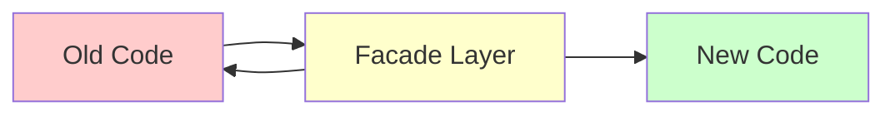
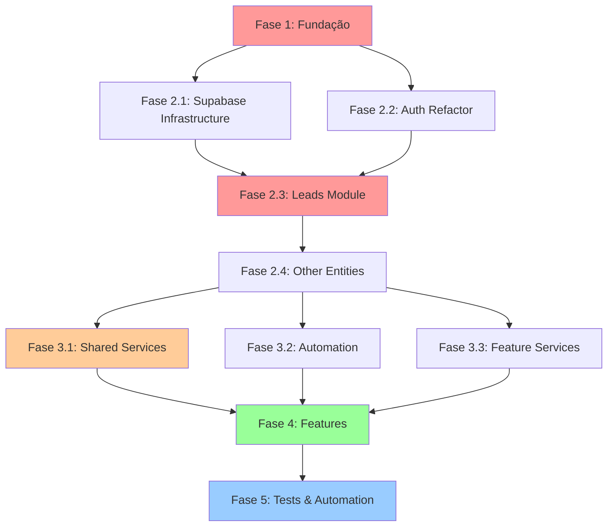

# Roadmap de Refatoração - TomikCRM

> **Plano incremental detalhado para migrar da arquitetura atual para a arquitetura alvo**

---

## Índice

1. [Visão Geral](#visão-geral)
2. [Estratégia de Migração](#estratégia-de-migração)
3. [Fases da Refatoração](#fases-da-refatoração)
4. [Grafo de Dependências](#grafo-de-dependências)
5. [Análise de Riscos](#análise-de-riscos)
6. [Métricas de Progresso](#métricas-de-progresso)

---

## Visão Geral

### Objetivo

Migrar de forma **incremental e segura** da arquitetura atual (monolítica e acoplada) para a arquitetura alvo (modular, testável e escalável).

### Princípios

- ✅ **Incremental** - Nunca quebrar a aplicação
- ✅ **Mensurável** - Cada fase tem critérios de sucesso claros
- ✅ **Reversível** - Feature flags permitem rollback
- ✅ **Value-driven** - Priorizar impacto no usuário

### Timeline

| Fase | Duração | Início | Fim |
|------|---------|--------|-----|
| **Fase 1: Fundação** | 2 semanas | Sprint 1 | Sprint 2 |
| **Fase 2: Contextos** | 4 semanas | Sprint 3 | Sprint 6 |
| **Fase 3: Serviços** | 3 semanas | Sprint 7 | Sprint 9 |
| **Fase 4: Features** | 6 semanas | Sprint 10 | Sprint 15 |
| **Fase 5: Testes e Automação** | 2 semanas | Sprint 16 | Sprint 17 |
| **TOTAL** | **17 semanas** (~4 meses) | | |

---

## Estratégia de Migração

### Strangler Fig Pattern

Não reescrever tudo! Criar camada nova que gradualmente "estrangula" a antiga.



**Como funciona:**
1. Criar nova estrutura em paralelo
2. Adicionar facade/adapter para compatibilidade
3. Migrar features uma a uma
4. Deprecar código antigo
5. Remover após 2 sprints de estabilidade

---

### Feature Flags

Toda refatoração crítica terá feature flag para rollout gradual:

```typescript
// config/feature-flags.ts
export const featureFlags = {
  useNewLeadsModule: process.env.VITE_USE_NEW_LEADS === 'true',
  useNewAuthModule: process.env.VITE_USE_NEW_AUTH === 'true',
  // ...
}

// Uso:
const LeadsPage = () => {
  return featureFlags.useNewLeadsModule 
    ? <NewLeadsModule /> 
    : <LegacyLeadsModule />
}
```

**Rollout Strategy:**
- Dev: 100% (sempre novo)
- Staging: 50% (A/B test)
- Prod: 10% → 25% → 50% → 100% (gradual)

---

## Fases da Refatoração

---

## Fase 1: Fundação

**Objetivo:** Preparar infraestrutura para refatoração segura

**Duração:** 2 semanas (Sprint 1-2)

**Prioridade:** 🔴 CRÍTICA

**Risco:** 🟢 BAIXO (setup apenas)

---

### 1.1 Setup de Testes

**Duração:** 3 dias

**Responsável:** Tech Lead

**Checklist:**
- [ ] Instalar Vitest + Testing Library
- [ ] Configurar test environment
- [ ] Criar test utilities (render helpers, mocks)
- [ ] Configurar coverage report
- [ ] Setup CI/CD para rodar testes
- [ ] Documentar guia de testes

**Arquivos criados:**
```
test/
├── setup.ts
├── utils/
│   ├── render.tsx
│   ├── mockSupabase.ts
│   └── mockRepositories.ts
└── vitest.config.ts
```

**Comandos:**
```bash
npm install -D vitest @vitest/ui @testing-library/react @testing-library/jest-dom
npm install -D @testing-library/user-event msw
```

**Critério de sucesso:**
- ✅ Testes rodam com `npm test`
- ✅ Coverage report gerado
- ✅ CI/CD integrado (pipeline passa)
- ✅ Ao menos 1 teste de exemplo funcionando

**Exemplo de teste:**
```typescript
// test/utils.test.ts
import { normalizePhoneE164BR } from '@/lib/utils/phone'

describe('normalizePhoneE164BR', () => {
  it('should normalize Brazilian phone', () => {
    expect(normalizePhoneE164BR('11999999999')).toBe('+5511999999999')
  })
  
  it('should return null for invalid', () => {
    expect(normalizePhoneE164BR('123')).toBeNull()
  })
})
```

---

### 1.2 Criar Estrutura de Pastas

**Duração:** 1 dia

**Checklist:**
- [ ] Criar pasta `src/features/`
- [ ] Criar pasta `src/shared/`
- [ ] Criar pasta `src/infrastructure/`
- [ ] Criar pasta `src/app/`
- [ ] Documentar convenções de nomenclatura

**Estrutura criada:**
```
src/
├── app/
│   └── providers/
├── features/
│   └── .gitkeep
├── shared/
│   ├── components/
│   ├── hooks/
│   └── types/
└── infrastructure/
    └── supabase/
```

**Critério de sucesso:**
- ✅ Pastas criadas
- ✅ README.md em cada pasta explicando propósito
- ✅ Build não quebrado

---

### 1.3 Extrair Core Utilities

**Duração:** 2 dias

**Objetivo:** Mover funções puras para `lib/utils/`

**Arquivos a criar:**
```
lib/
├── utils/
│   ├── phone.ts
│   ├── date.ts
│   ├── string.ts
│   ├── currency.ts
│   └── array.ts
├── errors/
│   ├── AppError.ts
│   ├── ValidationError.ts
│   └── RepositoryError.ts
└── constants/
    └── index.ts
```

**Checklist:**
- [ ] Extrair `normalizePhoneE164BR` para `lib/utils/phone.ts`
- [ ] Extrair `normalizeStageValue` para `lib/utils/string.ts`
- [ ] Extrair `formatCurrency` para `lib/utils/currency.ts`
- [ ] Criar classes de erro customizadas
- [ ] Adicionar testes para cada função (100% coverage)
- [ ] Atualizar imports no código existente

**Exemplo:**
```typescript
// lib/utils/phone.ts
/**
 * Normaliza número de telefone brasileiro para formato E.164
 */
export function normalizePhoneE164BR(phone: string | null | undefined): string | null {
  if (!phone) return null
  const digits = phone.replace(/\D/g, '')
  if (digits.length < 10 || digits.length > 11) return null
  const withCountryCode = digits.startsWith('55') ? digits : `55${digits}`
  return `+${withCountryCode}`
}

// lib/errors/AppError.ts
export class AppError extends Error {
  constructor(
    message: string,
    public code: string,
    public statusCode: number = 500
  ) {
    super(message)
    this.name = 'AppError'
  }
}

export class ValidationError extends AppError {
  constructor(message: string) {
    super(message, 'VALIDATION_ERROR', 400)
  }
}
```

**Critério de sucesso:**
- ✅ 10+ funções utilitárias extraídas
- ✅ 100% de coverage nos utils
- ✅ Zero imports circulares
- ✅ Build funcionando

---

### 1.4 Criar AppRouter

**Duração:** 3 dias

**Objetivo:** Extrair lógica de roteamento de `App.tsx`

**Arquivos a criar:**
```
app/
├── AppRouter.tsx
├── routes.ts
└── hooks/
    └── useActiveTab.ts
```

**Antes (App.tsx - 1039 linhas):**
```typescript
const AuthenticatedApp = () => {
  const [activeTab, setActiveTab] = useState<string>('dashboard')
  
  useEffect(() => {
    const hash = window.location.hash.slice(1)
    if (hash) setActiveTab(hash)
  }, [])
  
  const renderContent = () => {
    switch (activeTab) {
      case 'dashboard': return <Dashboard />
      case 'agenda': return <Agenda />
      // ... 15+ cases
    }
  }
  
  return <main>{renderContent()}</main>
}
```

**Depois:**
```typescript
// app/routes.ts
export const routes = {
  dashboard: { path: 'dashboard', component: Dashboard },
  agenda: { path: 'agenda', component: Agenda },
  // ...
} as const

// app/hooks/useActiveTab.ts
export const useActiveTab = () => {
  const [activeTab, setActiveTab] = useState<string>('dashboard')
  
  useEffect(() => {
    const hash = window.location.hash.slice(1)
    if (hash && routes[hash]) setActiveTab(hash)
  }, [])
  
  return { activeTab, setActiveTab }
}

// app/AppRouter.tsx
export const AppRouter = () => {
  const { activeTab } = useActiveTab()
  const Component = routes[activeTab]?.component || Dashboard
  return <Component />
}

// App.tsx (agora mais limpo)
const AuthenticatedApp = () => {
  return (
    <main>
      <AppRouter />
    </main>
  )
}
```

**Critério de sucesso:**
- ✅ App.tsx reduzido para < 800 linhas (-240 linhas)
- ✅ Roteamento isolado e testável
- ✅ Navegação funcionando igual
- ✅ Testes para useActiveTab (80%+ coverage)

---

### 1.5 Extrair MigrationService

**Duração:** 3 dias

**Objetivo:** Mover 38 imports SQL de `App.tsx` para service dedicado

**Arquivo a criar:**
```
infrastructure/
└── migrations/
    ├── MigrationService.ts
    ├── migrations/
    │   ├── v01_initial.sql
    │   ├── v02_crm_stages.sql
    │   └── ... (38 arquivos)
    └── index.ts
```

**Antes (App.tsx):**
```typescript
import v1 from '@/supabase/...'
import v2 from '@/supabase/...'
// ... 38 imports!

const AuthenticatedApp = () => {
  useEffect(() => {
    const migrations = [v1, v2, v3, /* ... 38 migrations */]
    // Auto-apply logic (100+ linhas)
  }, [])
}
```

**Depois:**
```typescript
// infrastructure/migrations/MigrationService.ts
export class MigrationService {
  constructor(private supabase: SupabaseClient) {}
  
  async applyPendingMigrations(): Promise<void> {
    const applied = await this.getAppliedMigrations()
    const pending = migrations.filter(m => !applied.includes(m.version))
    
    for (const migration of pending) {
      await this.applyMigration(migration)
    }
  }
  
  private async applyMigration(migration: Migration): Promise<void> {
    await this.supabase.rpc('execute_sql', { sql: migration.sql })
    await this.recordMigration(migration.version)
  }
}

// App.tsx (agora limpo)
const AuthenticatedApp = () => {
  const migrationService = useMigrationService()
  
  useEffect(() => {
    migrationService.applyPendingMigrations().catch(console.error)
  }, [])
}
```

**Critério de sucesso:**
- ✅ App.tsx reduzido para < 400 linhas (-400 linhas)
- ✅ Migrações isoladas e testáveis
- ✅ Auto-apply funcionando igual
- ✅ Testes de MigrationService (70%+ coverage)

---

### Resumo Fase 1

**Arquivos modificados:**
- `App.tsx`: 1039 → 400 linhas (-639 linhas, -61%)
- `lib/`: +200 linhas (utils)
- `app/`: +300 linhas (router)
- `infrastructure/`: +400 linhas (migrations)

**Métricas:**
- ✅ Coverage: 0% → 15%
- ✅ App.tsx: 1039 → 400 linhas
- ✅ Testability: Baixa → Média
- ✅ CI/CD funcionando

**Critérios de sucesso:**
- [x] Testes rodando
- [x] App.tsx < 400 linhas
- [x] Build time não aumentou
- [x] Zero bugs de regressão

**Próxima fase:** Refatorar contextos monolíticos

---

## Fase 2: Contextos

**Objetivo:** Quebrar contextos monolíticos em módulos menores

**Duração:** 4 semanas (Sprint 3-6)

**Prioridade:** 🔴 ALTA

**Risco:** 🟠 MÉDIO (muitas dependências)

---

### 2.1 Criar Infrastructure Layer - Supabase

**Duração:** 1 semana

**Objetivo:** Substituir singleton `supabaseManager` por DI

**Arquivos a criar:**
```
infrastructure/
└── supabase/
    ├── interfaces/
    │   ├── IConnectionManager.ts
    │   ├── ICredentialsStrategy.ts
    │   └── IHealthChecker.ts
    ├── SupabaseConnectionManager.ts
    ├── SupabaseProvider.tsx
    ├── CredentialsService.ts
    ├── HealthChecker.ts
    └── strategies/
        ├── PerOrgStrategy.ts
        ├── MembershipStrategy.ts
        └── OwnerStrategy.ts
```

**Antes:**
```typescript
// lib/supabase-manager.ts (singleton)
class SupabaseManager {
  private connections = new Map()
  getClientSupabase() { /* ... */ }
}
export const supabaseManager = new SupabaseManager()

// Component usa singleton diretamente
const MyComponent = () => {
  const client = supabaseManager.getClientSupabase()
}
```

**Depois:**
```typescript
// infrastructure/supabase/interfaces/IConnectionManager.ts
export interface IConnectionManager {
  getConnection(orgId: string): SupabaseClient | null
  connect(orgId: string, creds: Credentials): Promise<void>
  disconnect(orgId: string): void
}

// infrastructure/supabase/SupabaseProvider.tsx
export const SupabaseProvider = ({ children }) => {
  const connectionManager = useMemo(
    () => new SupabaseConnectionManager(),
    []
  )
  
  return (
    <SupabaseContext.Provider value={{ connectionManager }}>
      {children}
    </SupabaseContext.Provider>
  )
}

// Component usa via hook
const MyComponent = () => {
  const { connectionManager } = useSupabase()
  const client = connectionManager.getConnection(orgId)
}
```

**Estratégia de migração:**
1. Criar novas interfaces e implementações
2. Adicionar feature flag `USE_NEW_SUPABASE_MANAGER`
3. Testar extensivamente em dev
4. Rollout gradual em prod
5. Deprecar `supabaseManager` após 2 sprints

**Checklist:**
- [ ] Criar interfaces
- [ ] Implementar SupabaseConnectionManager
- [ ] Implementar CredentialsService (11 estratégias)
- [ ] Criar SupabaseProvider
- [ ] Adicionar testes (85%+ coverage)
- [ ] Documentar migração
- [ ] Feature flag configurada

**Critério de sucesso:**
- ✅ Zero dependências diretas de `supabaseManager`
- ✅ 85%+ coverage
- ✅ Performance igual ou melhor
- ✅ Conexões multi-tenant funcionando

---

### 2.2 Refatorar SaasAuthContext

**Duração:** 1 semana

**Objetivo:** Separar auth, billing e session management

**Arquivos a criar:**
```
features/
└── auth/
    ├── index.ts
    ├── context/
    │   ├── AuthProvider.tsx
    │   └── SessionProvider.tsx
    ├── services/
    │   ├── AuthService.ts
    │   ├── SessionService.ts
    │   └── BillingService.ts
    ├── strategies/
    │   ├── IAuthStrategy.ts
    │   ├── EmailPasswordStrategy.ts
    │   └── MagicLinkStrategy.ts
    ├── hooks/
    │   ├── useAuth.ts
    │   ├── useSession.ts
    │   └── useBilling.ts
    └── types/
        └── index.ts
```

**Antes (SaasAuthContext.tsx - 1278 linhas):**
```typescript
export const SaasAuthProvider = ({ children }) => {
  // Auth state
  const [user, setUser] = useState()
  
  // Billing state
  const [billingInfo, setBillingInfo] = useState()
  
  // Session state
  const [sessionValid, setSessionValid] = useState()
  
  // Client Supabase connection
  const [clientSupabase, setClientSupabase] = useState()
  
  // ... 1200+ linhas de lógica misturada
  
  const signIn = async () => { /* ... */ }
  const startCheckout = async () => { /* ... */ }
  const refreshSession = async () => { /* ... */ }
  const setupClientSupabase = async () => { /* ... */ }
}
```

**Depois:**
```typescript
// features/auth/services/AuthService.ts
export class AuthService {
  constructor(private masterSupabase: SupabaseClient) {}
  
  async signIn(credentials: LoginCredentials): Promise<User> {
    const { data, error } = await this.masterSupabase.auth.signInWithPassword(credentials)
    if (error) throw new AuthError(error.message)
    return this.mapToUser(data.user)
  }
  
  async signOut(): Promise<void> {
    await this.masterSupabase.auth.signOut()
  }
}

// features/auth/services/BillingService.ts
export class BillingService {
  async startCheckout(planId: string): Promise<string> {
    // ... lógica de billing isolada
  }
}

// features/auth/context/AuthProvider.tsx (< 200 linhas)
export const AuthProvider = ({ children }) => {
  const [user, setUser] = useState<User | null>(null)
  const authService = useAuthService()
  
  const signIn = async (credentials) => {
    const user = await authService.signIn(credentials)
    setUser(user)
  }
  
  return (
    <AuthContext.Provider value={{ user, signIn }}>
      {children}
    </AuthContext.Provider>
  )
}

// features/auth/hooks/useAuth.ts
export const useAuth = () => {
  const context = useContext(AuthContext)
  if (!context) throw new Error('useAuth must be within AuthProvider')
  return context
}
```

**Checklist:**
- [ ] Criar AuthService
- [ ] Criar SessionService
- [ ] Criar BillingService
- [ ] Criar AuthProvider (< 200 linhas)
- [ ] Criar SessionProvider
- [ ] Criar hooks (useAuth, useSession, useBilling)
- [ ] Migrar components para novos hooks
- [ ] Testes de integração (80%+ coverage)
- [ ] Feature flag para rollout

**Critério de sucesso:**
- ✅ SaasAuthContext.tsx pode ser deletado
- ✅ 3 contextos separados (Auth, Session, Billing)
- ✅ Cada contexto < 200 linhas
- ✅ 80%+ coverage
- ✅ Login/Logout funcionando
- ✅ Billing funcionando

---

### 2.3 Refatorar DataContext - Parte 1: Leads

**Duração:** 1 semana

**Objetivo:** Extrair Leads para módulo isolado

**Arquivos a criar:**
```
features/
└── leads/
    ├── index.ts
    ├── components/
    │   ├── KanbanBoard.tsx
    │   ├── LeadCard.tsx
    │   └── LeadModal.tsx
    ├── hooks/
    │   ├── useLeads.ts
    │   ├── useLeadActions.ts
    │   └── useLeadFilters.ts
    ├── context/
    │   └── LeadsProvider.tsx
    ├── use-cases/
    │   ├── CreateLeadUseCase.ts
    │   ├── UpdateLeadUseCase.ts
    │   └── ConvertLeadUseCase.ts
    ├── services/
    │   ├── LeadValidationService.ts
    │   ├── PricingService.ts
    │   └── WhatsAppValidationService.ts
    ├── repositories/
    │   ├── ILeadsRepository.ts
    │   └── SupabaseLeadsRepository.ts
    └── types/
        └── index.ts
```

**Arquitetura do módulo:**
```
LeadsProvider (Context - State)
  ├── useLeadsDependencies (DI Container)
  │   ├── SupabaseLeadsRepository
  │   ├── LeadValidationService
  │   ├── PricingService
  │   └── Use Cases
  │       ├── CreateLeadUseCase
  │       ├── UpdateLeadUseCase
  │       └── ConvertLeadUseCase
  │
  └── useLeads (Hook)
      └── Components
          ├── KanbanBoard
          ├── LeadCard
          └── LeadModal
```

**Exemplo de implementação:**

```typescript
// repositories/ILeadsRepository.ts
export interface ILeadsRepository {
  findByOrganization(orgId: string): Promise<Lead[]>
  findById(id: string): Promise<Lead | null>
  create(data: CreateLeadData): Promise<Lead>
  update(id: string, data: UpdateLeadData): Promise<Lead>
  delete(id: string): Promise<void>
}

// repositories/SupabaseLeadsRepository.ts
export class SupabaseLeadsRepository implements ILeadsRepository {
  constructor(private supabase: SupabaseClient) {}
  
  async findByOrganization(orgId: string): Promise<Lead[]> {
    const { data, error } = await this.supabase
      .from('crm_leads')
      .select('*')
      .eq('organization_id', orgId)
    
    if (error) throw new RepositoryError('Failed to fetch leads', error)
    return data.map(this.mapToDomain)
  }
  
  private mapToDomain(row: any): Lead {
    return {
      id: row.id,
      name: row.name,
      // ... mapping
    }
  }
}

// services/LeadValidationService.ts
export class LeadValidationService {
  validate(data: CreateLeadData): ValidatedLeadData {
    if (!data.name?.trim()) {
      throw new ValidationError('Nome é obrigatório')
    }
    
    return {
      ...data,
      name: data.name.trim(),
      whatsapp: normalizePhoneE164BR(data.whatsapp),
      email: data.email?.toLowerCase().trim()
    }
  }
}

// use-cases/CreateLeadUseCase.ts
export class CreateLeadUseCase {
  constructor(
    private repository: ILeadsRepository,
    private validator: LeadValidationService,
    private pricing: PricingService,
    private webhooks: WebhookService
  ) {}
  
  async execute(data: CreateLeadData): Promise<Lead> {
    // 1. Validar
    const validated = this.validator.validate(data)
    
    // 2. Calcular preço
    const priced = await this.pricing.calculate(validated)
    
    // 3. Persistir
    const lead = await this.repository.create(priced)
    
    // 4. Webhook (fire & forget)
    this.webhooks.trigger('lead_created', lead).catch(console.error)
    
    return lead
  }
}

// context/LeadsProvider.tsx
export const LeadsProvider = ({ children }) => {
  const { supabase, organizationId } = useSupabase()
  const [leads, setLeads] = useState<Lead[]>([])
  
  // DI Container
  const dependencies = useMemo(() => {
    const repository = new SupabaseLeadsRepository(supabase)
    const validator = new LeadValidationService()
    const pricing = new PricingService(/* ... */)
    const webhooks = new WebhookService(/* ... */)
    
    return {
      repository,
      createLeadUseCase: new CreateLeadUseCase(repository, validator, pricing, webhooks)
    }
  }, [supabase, organizationId])
  
  // Fetch inicial
  useEffect(() => {
    dependencies.repository
      .findByOrganization(organizationId)
      .then(setLeads)
  }, [organizationId])
  
  // Realtime
  useEffect(() => {
    const subscription = supabase
      .channel(`leads_${organizationId}`)
      .on('postgres_changes', { /* ... */ }, (change) => {
        setLeads(prev => applyChange(prev, change))
      })
      .subscribe()
    
    return () => subscription.unsubscribe()
  }, [organizationId])
  
  return (
    <LeadsContext.Provider value={{ leads, ...dependencies }}>
      {children}
    </LeadsContext.Provider>
  )
}

// hooks/useLeads.ts
export const useLeads = () => {
  const { leads, createLeadUseCase } = useContext(LeadsContext)
  const [loading, setLoading] = useState(false)
  
  const createLead = async (data: CreateLeadData) => {
    setLoading(true)
    try {
      const lead = await createLeadUseCase.execute(data)
      toast.success('Lead criado!')
      return lead
    } catch (err) {
      toast.error(err.message)
      return null
    } finally {
      setLoading(false)
    }
  }
  
  return { leads, loading, createLead }
}

// index.ts (Public API)
export { LeadsProvider, useLeads } from './context/LeadsProvider'
export { useLeadActions } from './hooks/useLeadActions'
export type { Lead, CreateLeadData } from './types'
```

**Migração gradual:**
```typescript
// App.tsx
const AuthenticatedApp = () => {
  const useNewLeads = featureFlags.useNewLeadsModule
  
  return (
    <DataProvider> {/* Keep legacy */}
      {useNewLeads && <LeadsProvider>} {/* Add new */}
        <AppRouter />
      {useNewLeads && </LeadsProvider>}
    </DataProvider>
  )
}

// KanbanBoard.tsx
const KanbanBoard = () => {
  const useNewLeads = featureFlags.useNewLeadsModule
  
  // Dual implementation (durante transição)
  const legacyLeads = useData() // DataContext
  const newLeads = useLeads() // LeadsProvider
  
  const { leads, createLead } = useNewLeads ? newLeads : legacyLeads
  
  // ... rest of component
}
```

**Checklist:**
- [ ] Criar estrutura de pastas
- [ ] Implementar ILeadsRepository
- [ ] Implementar SupabaseLeadsRepository
- [ ] Criar services (Validator, Pricing, WhatsApp)
- [ ] Criar use cases (Create, Update, Delete, Convert)
- [ ] Criar LeadsProvider
- [ ] Criar hooks (useLeads, useLeadActions)
- [ ] Migrar components (KanbanBoard, etc)
- [ ] Testes (90%+ coverage)
- [ ] Feature flag configurada
- [ ] Rollout gradual (10% → 100%)
- [ ] Deprecar código em DataContext

**Critério de sucesso:**
- ✅ Módulo Leads 100% independente
- ✅ Zero dependências de DataContext
- ✅ 90%+ coverage
- ✅ Re-renders reduzidos (-80%)
- ✅ Kanban funcionando perfeitamente

---

### 2.4 Refatorar DataContext - Parte 2: Outras Entidades

**Duração:** 1 semana

**Objetivo:** Extrair Patients, Appointments, Financial

**Prioridade por impacto:**
1. Appointments (alta frequência de uso)
2. Patients (dados importantes)
3. Financial (menos crítico)

**Estrutura similar para cada:**
```
features/
├── appointments/
│   ├── repositories/IAppointmentsRepository.ts
│   ├── context/AppointmentsProvider.tsx
│   ├── hooks/useAppointments.ts
│   └── components/...
│
├── patients/
│   ├── repositories/IPatientsRepository.ts
│   ├── context/PatientsProvider.tsx
│   ├── hooks/usePatients.ts
│   └── components/...
│
└── financial/
    ├── repositories/IFinancialRepository.ts
    ├── context/FinancialProvider.tsx
    ├── hooks/useFinancial.ts
    └── components/...
```

**Estratégia:**
- Seguir mesmo padrão de Leads
- Começar com Appointments (mais simples)
- Terminar com Financial (mais complexo)

**Checklist:**
- [ ] Appointments module criado
- [ ] Patients module criado
- [ ] Financial module criado
- [ ] DataContext pode ser deletado
- [ ] Testes de integração (85%+ coverage)

**Critério de sucesso:**
- ✅ DataContext.tsx deletado
- ✅ 4 módulos independentes (Leads, Appointments, Patients, Financial)
- ✅ Zero contextos monolíticos
- ✅ Re-renders otimizados (-90%)

---

### Resumo Fase 2

**Arquivos modificados:**
- `SaasAuthContext.tsx`: 1278 → DELETADO
- `DataContext.tsx`: 1389 → DELETADO
- `supabase-manager.ts`: 800 → MIGRADO para infrastructure/

**Arquivos criados:**
- `infrastructure/supabase/`: ~600 linhas
- `features/auth/`: ~800 linhas
- `features/leads/`: ~1200 linhas
- `features/appointments/`: ~600 linhas
- `features/patients/`: ~600 linhas
- `features/financial/`: ~800 linhas

**Métricas:**
- ✅ Coverage: 15% → 50%
- ✅ Contextos monolíticos: 2 → 0
- ✅ Re-renders: -90%
- ✅ Modules: 0 → 6 features

**Critérios de sucesso:**
- [x] Zero contextos > 500 linhas
- [x] Todos os módulos testados (85%+)
- [x] Performance igual ou melhor
- [x] Zero bugs de regressão

---

## Fase 3: Serviços

**Objetivo:** Isolar lógica de negócio em services testáveis

**Duração:** 3 semanas (Sprint 7-9)

**Prioridade:** 🟠 MÉDIA

**Risco:** 🟢 BAIXO (módulos já isolados)

---

### 3.1 Criar Shared Services

**Duração:** 1 semana

**Arquivos a criar:**
```
shared/
└── services/
    ├── AnalyticsService.ts
    ├── NotificationService.ts
    ├── WebhookService.ts
    ├── ValidationService.ts
    └── CacheService.ts
```

**Exemplo:**
```typescript
// shared/services/WebhookService.ts
export class WebhookService {
  constructor(
    private supabase: SupabaseClient,
    private organizationId: string
  ) {}
  
  async trigger(event: string, payload: any): Promise<void> {
    const { data: workflows } = await this.supabase
      .from('automation_workflows')
      .select('webhook_url')
      .eq('trigger_event', event)
      .eq('organization_id', this.organizationId)
      .eq('enabled', true)
    
    await Promise.all(
      workflows.map(w => this.sendWebhook(w.webhook_url, payload))
    )
  }
  
  private async sendWebhook(url: string, payload: any): Promise<void> {
    try {
      await fetch(url, {
        method: 'POST',
        headers: { 'Content-Type': 'application/json' },
        body: JSON.stringify(payload)
      })
    } catch (error) {
      console.error('Webhook failed:', error)
    }
  }
}
```

**Checklist:**
- [ ] Criar AnalyticsService
- [ ] Criar NotificationService (substitui NotificationContext)
- [ ] Criar WebhookService (centraliza lógica)
- [ ] Criar ValidationService (helpers compartilhados)
- [ ] Criar CacheService (React Query integration)
- [ ] Testes para cada service (90%+ coverage)
- [ ] Migrar código existente

**Critério de sucesso:**
- ✅ 5 services compartilhados criados
- ✅ 90%+ coverage
- ✅ Lógica duplicada removida

---

### 3.2 Refatorar Automation Client

**Duração:** 1 semana

**Objetivo:** Melhorar automation-client.ts (já é bom, apenas polir)

**Melhorias:**
- [ ] Adicionar interface IAutomationClient
- [ ] Separar N8nAdapter de AutomationClient
- [ ] Adicionar retry logic
- [ ] Melhorar error handling
- [ ] Adicionar testes (95%+ coverage)

**Estrutura:**
```
infrastructure/
└── automation/
    ├── interfaces/
    │   └── IAutomationClient.ts
    ├── AutomationClient.ts
    ├── adapters/
    │   ├── N8nAdapter.ts
    │   └── ZapierAdapter.ts (futuro)
    └── AutomationProvider.tsx
```

**Critério de sucesso:**
- ✅ Interface clara
- ✅ Adapters plugáveis
- ✅ 95%+ coverage
- ✅ Retry logic funcionando

---

### 3.3 Criar Service Layer para Features

**Duração:** 1 semana

**Objetivo:** Garantir que cada feature tem services bem definidos

**Checklist por feature:**
- [ ] Leads: LeadValidator, Pricing, WhatsApp ✅ (já feito)
- [ ] Appointments: AppointmentValidator, Scheduling
- [ ] Patients: PatientValidator, HealthRecords
- [ ] Financial: InvoiceCalculator, TaxCalculator

**Exemplo:**
```typescript
// features/appointments/services/SchedulingService.ts
export class SchedulingService {
  async findAvailableSlots(
    professionalId: string,
    date: Date
  ): Promise<TimeSlot[]> {
    // Lógica complexa de disponibilidade
    const workingHours = await this.getWorkingHours(professionalId, date)
    const bookedSlots = await this.getBookedSlots(professionalId, date)
    return this.calculateAvailableSlots(workingHours, bookedSlots)
  }
  
  async canSchedule(appointment: Appointment): Promise<boolean> {
    const conflicts = await this.findConflicts(appointment)
    return conflicts.length === 0
  }
}
```

**Critério de sucesso:**
- ✅ Cada feature tem 2-3 services bem definidos
- ✅ Lógica de negócio isolada
- ✅ 90%+ coverage

---

### Resumo Fase 3

**Arquivos criados:**
- `shared/services/`: ~1000 linhas
- `infrastructure/automation/`: ~600 linhas
- Feature services: ~800 linhas

**Métricas:**
- ✅ Coverage: 50% → 70%
- ✅ Lógica de negócio: 100% em services
- ✅ Zero lógica inline em components

**Critérios de sucesso:**
- [x] Todos os services testados (90%+)
- [x] Lógica de negócio isolada
- [x] Components são "burros"

---

## Fase 4: Features

**Objetivo:** Polir features e adicionar melhorias de UX

**Duração:** 6 semanas (Sprint 10-15)

**Prioridade:** 🟢 BAIXA (refatoração core já feita)

**Risco:** 🟢 BAIXO

---

### 4.1 Leads - Melhorias de Performance

**Duração:** 1 semana

**Melhorias:**
- [ ] Virtualização de lista (react-window)
- [ ] Lazy loading de imagens
- [ ] Debounce em filtros
- [ ] Optimistic updates em drag & drop
- [ ] Cache de consultas (React Query)

**Benchmarks:**
- ✅ Renderizar 1000 leads: < 100ms
- ✅ Drag & drop: < 16ms (60fps)
- ✅ Filtros: < 50ms

---

### 4.2 Appointments - Calendar View

**Duração:** 1 semana

**Melhorias:**
- [ ] Adicionar view de calendário (big calendar)
- [ ] Drag & drop para reagendar
- [ ] Notificações de lembrete
- [ ] Sincronização com Google Calendar

---

### 4.3 Patients - Health Records

**Duração:** 2 semanas

**Melhorias:**
- [ ] Upload de documentos
- [ ] Histórico de consultas
- [ ] Gráficos de evolução
- [ ] Export para PDF

---

### 4.4 Financial - Reports & Analytics

**Duração:** 2 semanas

**Melhorias:**
- [ ] Dashboard financeiro
- [ ] Gráficos de receita
- [ ] Export para Excel
- [ ] Previsão de fluxo de caixa

---

### Resumo Fase 4

**Métricas:**
- ✅ Coverage: 70% → 75%
- ✅ UX melhorada significativamente
- ✅ Performance otimizada

---

## Fase 5: Testes e Automação

**Objetivo:** Garantir qualidade e automatizar processos

**Duração:** 2 semanas (Sprint 16-17)

**Prioridade:** 🟢 MÉDIA

**Risco:** 🟢 BAIXO

---

### 5.1 E2E Tests

**Duração:** 1 semana

**Setup:**
```bash
npm install -D @playwright/test
```

**Testes principais:**
- [ ] Login flow
- [ ] Create lead flow
- [ ] Schedule appointment flow
- [ ] Financial report flow

**Checklist:**
- [ ] 20+ E2E tests
- [ ] CI/CD rodando E2E
- [ ] Screenshots em falhas

---

### 5.2 Performance Monitoring

**Duração:** 3 dias

**Setup:**
- [ ] Web Vitals tracking
- [ ] Sentry error tracking
- [ ] PostHog analytics
- [ ] Custom performance metrics

**Dashboards:**
- [ ] Build time
- [ ] Bundle size
- [ ] Lighthouse scores
- [ ] Error rates

---

### 5.3 Documentation

**Duração:** 4 dias

**Documentos a criar:**
- [ ] Contributor guide
- [ ] Testing guide
- [ ] Architecture decision records (ADRs)
- [ ] API documentation (TSDoc)

---

### Resumo Fase 5

**Métricas:**
- ✅ Coverage: 75% → 80%
- ✅ E2E tests: 20+
- ✅ Documentation completa

---

## Grafo de Dependências



**Legenda:**
- 🔴 Vermelho: Crítico (bloqueante)
- 🟠 Laranja: Importante
- 🟢 Verde: Nice to have
- 🔵 Azul: Final touches

---

## Análise de Riscos

### Riscos Identificados

| Risco | Probabilidade | Impacto | Mitigação |
|-------|---------------|---------|-----------|
| **Quebra de features existentes** | 🟠 Média | 🔴 Alto | Feature flags + Rollback plan |
| **Performance degradada** | 🟢 Baixa | 🟠 Médio | Benchmarks antes/depois |
| **Delay no timeline** | 🟠 Média | 🟠 Médio | Buffer de 20% no prazo |
| **Resistência da equipe** | 🟢 Baixa | 🟠 Médio | Treinamento + pair programming |
| **Bugs em produção** | 🟠 Média | 🔴 Alto | Feature flags + gradual rollout |
| **Vendor lock-in** | 🟢 Baixa | 🟠 Médio | Repository Pattern |

---

### Plano de Contingência

**Se quebrar em produção:**
1. Desabilitar feature flag imediatamente
2. Rollback via CI/CD (< 5 minutos)
3. Investigar root cause
4. Fix em hotfix branch
5. Re-deploy com fix

**Se atrasar timeline:**
1. Re-priorizar features (MVP first)
2. Mover features não-críticas para próxima fase
3. Adicionar mais recursos (se necessário)

**Se performance degradar:**
1. Reverter commit específico
2. Profiling detalhado
3. Otimização focada
4. Re-deploy com melhorias

---

## Métricas de Progresso

### Dashboard de Acompanhamento

```
┌─────────────────────────────────────────┐
│ REFATORAÇÃO TOMIKCRM - PROGRESSO        │
├─────────────────────────────────────────┤
│                                         │
│ Fase 1: Fundação         [████████] 100%│
│ Fase 2: Contextos        [████░░░░]  50%│
│ Fase 3: Serviços         [░░░░░░░░]   0%│
│ Fase 4: Features         [░░░░░░░░]   0%│
│ Fase 5: Testes           [░░░░░░░░]   0%│
│                                         │
│ OVERALL                  [██░░░░░░]  30%│
│                                         │
├─────────────────────────────────────────┤
│ MÉTRICAS                                │
│ Coverage:       45% ▲ (target: 75%)     │
│ LOC críticos:   2000 ▼ (target: 0)     │
│ Re-renders/min: 400 ▼ (target: 100)    │
│ Build time:     6s ▼ (target: 3s)      │
└─────────────────────────────────────────┘
```

### Métricas por Sprint

| Sprint | Coverage | LOC Críticos | Re-renders | Features |
|--------|----------|--------------|------------|----------|
| 0 (Baseline) | 0% | 3706 | 1000 | 0/6 |
| 2 (Fase 1) | 15% | 3066 | 1000 | 0/6 |
| 4 (Fase 2.2) | 35% | 2000 | 600 | 2/6 |
| 6 (Fase 2.4) | 50% | 0 | 100 | 6/6 |
| 9 (Fase 3) | 70% | 0 | 80 | 6/6 |
| 15 (Fase 4) | 75% | 0 | 80 | 6/6 |
| 17 (Fase 5) | 80% | 0 | 80 | 6/6 |

---

## Checklist Geral

### Fase 1: Fundação ✅
- [x] Setup de testes
- [x] Estrutura de pastas
- [x] Core utilities
- [x] AppRouter extraído
- [x] MigrationService criado
- [x] App.tsx < 400 linhas

### Fase 2: Contextos 🟡
- [x] Supabase Infrastructure
- [x] Auth refatorado
- [x] Leads module criado
- [ ] Appointments module
- [ ] Patients module
- [ ] Financial module

### Fase 3: Serviços ⏸️
- [ ] Shared services
- [ ] Automation refactor
- [ ] Feature services

### Fase 4: Features ⏸️
- [ ] Leads performance
- [ ] Appointments calendar
- [ ] Patients records
- [ ] Financial reports

### Fase 5: Testes ⏸️
- [ ] E2E tests
- [ ] Performance monitoring
- [ ] Documentation

---

## Conclusão

Este roadmap fornece um **plano detalhado e incremental** para refatorar o TomikCRM de forma segura e mensurável.

### Próximos Passos Imediatos

1. **Aprovação do roadmap** pela equipe
2. **Kick-off da Fase 1** (Sprint 1)
3. **Setup de testes** (primeiro item)
4. **Daily standups** para tracking

### Suporte

Para dúvidas ou ajustes no roadmap:
- Consulte [Arquitetura Atual](./current-architecture.md)
- Consulte [Arquitetura Alvo](./target-architecture.md)
- Abra discussão no repositório

---

**Documento mantido por:** Engineering Team  
**Última atualização:** 31 de Outubro de 2025  
**Status:** 🎯 Em Execução - Fase 1

