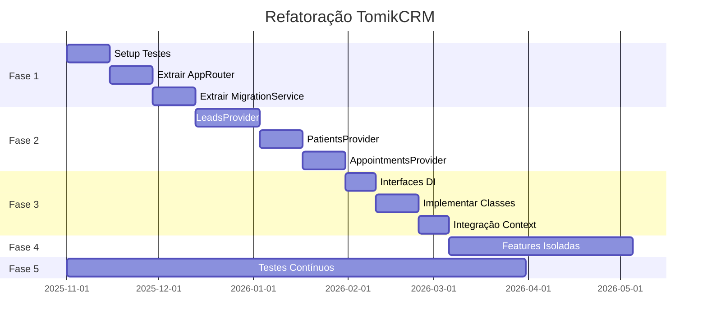

# Roadmap de Refatoração - TomikCRM

> Plano incremental para migrar de arquitetura monolítica para modular

---

## Índice

1. [Princípios da Refatoração](#princípios-da-refatoração)
2. [Fase 1: Fundação](#fase-1-fundação-2-3-sprints)
3. [Fase 2: Contextos Modulares](#fase-2-contextos-modulares-3-4-sprints)
4. [Fase 3: Serviços com DI](#fase-3-serviços-com-di-2-3-sprints)
5. [Fase 4: Features Isoladas](#fase-4-features-isoladas-ongoing)
6. [Fase 5: Testes e Qualidade](#fase-5-testes-e-qualidade-ongoing)
7. [Métricas de Sucesso](#métricas-de-sucesso)

---

## Princípios da Refatoração

### 1. Incremental, não Big Bang

❌ **Não fazer:** Reescrever tudo de uma vez
✅ **Fazer:** Refatorar um módulo por vez, mantendo a aplicação funcionando

### 2. Boy Scout Rule

> "Deixe o código melhor do que você encontrou"

Cada PR deve:
- Resolver um problema específico
- Adicionar ou atualizar testes
- Melhorar documentação

### 3. Backwards Compatibility

Durante a refatoração:
- Manter APIs antigas funcionando
- Adicionar `@deprecated` tags
- Remover código antigo apenas após 2 sprints

### 4. Feature Flags

Usar feature flags para refatorações arriscadas:
```typescript
const USE_NEW_LEADS_PROVIDER = import.meta.env.VITE_USE_NEW_LEADS_PROVIDER === 'true'

// Gradual rollout
const LeadsProviderToUse = USE_NEW_LEADS_PROVIDER ? LeadsProviderV2 : LeadsProvider
```

---

## Fase 1: Fundação (2-3 sprints)

**Objetivo:** Preparar base para refatorações maiores

### Sprint 1.1: Setup de Testes

**Tarefas:**
- [ ] Instalar Vitest + React Testing Library
- [ ] Configurar coverage reports
- [ ] Criar helpers de teste (`setupTests.ts`)
- [ ] Mockar Supabase Client
- [ ] Escrever primeiros 10 testes unitários

**Arquivos afetados:**
```
vitest.config.ts (novo)
src/test/
  ├── setup.ts
  ├── mocks/
  │   ├── supabase.ts
  │   └── contexts.tsx
  └── utils/
      └── render.tsx
```

**Exemplo de mock:**
```typescript
// src/test/mocks/supabase.ts
export const mockSupabaseClient = {
  from: vi.fn(() => ({
    select: vi.fn().mockResolvedValue({ data: [], error: null }),
    insert: vi.fn().mockResolvedValue({ data: {}, error: null }),
    update: vi.fn().mockResolvedValue({ data: {}, error: null }),
  })),
  rpc: vi.fn().mockResolvedValue({ data: null, error: null }),
}
```

**Critério de aceite:**
- ✅ Coverage de pelo menos 30% do código existente
- ✅ CI/CD rodando testes automaticamente

---

### Sprint 1.2: Extrair AppRouter

**Objetivo:** Separar lógica de roteamento de App.tsx

**Antes:**
```typescript
// App.tsx (1039 linhas)
function AuthenticatedApp() {
  const [activeTab, setActiveTab] = useState('james')
  // ... 800+ linhas de lógica de tabs
}
```

**Depois:**
```typescript
// routing/AppRouter.tsx
export const AppRouter = () => {
  const { pathname, hash } = useLocation()
  
  if (isPublicRoute(pathname)) return <PublicRoutes />
  if (!useAuth().isAuthenticated) return <AuthRoutes />
  return <AuthenticatedRoutes />
}

// routing/AuthenticatedRoutes.tsx
export const AuthenticatedRoutes = () => {
  const activeTab = useActiveTab() // Custom hook
  
  return (
    <AppLayout>
      {renderTab(activeTab)}
    </AppLayout>
  )
}

// hooks/useActiveTab.ts
export const useActiveTab = () => {
  const [tab, setTab] = useState(() => {
    // Parse from hash: #tab=kanban
    const match = window.location.hash.match(/#tab=(\w+)/)
    return match?.[1] || 'james'
  })
  
  // Sync with hash changes
  useEffect(() => {
    const handler = () => {
      const match = window.location.hash.match(/#tab=(\w+)/)
      if (match) setTab(match[1])
    }
    window.addEventListener('hashchange', handler)
    return () => window.removeEventListener('hashchange', handler)
  }, [])
  
  return [tab, setTab] as const
}
```

**Arquivos criados:**
```
src/routing/
  ├── AppRouter.tsx
  ├── PublicRoutes.tsx
  ├── AuthRoutes.tsx
  └── AuthenticatedRoutes.tsx
src/hooks/
  └── useActiveTab.ts
```

**Testes:**
```typescript
describe('useActiveTab', () => {
  it('should parse tab from hash', () => {
    window.location.hash = '#tab=kanban'
    const { result } = renderHook(() => useActiveTab())
    expect(result.current[0]).toBe('kanban')
  })
  
  it('should default to james', () => {
    window.location.hash = ''
    const { result } = renderHook(() => useActiveTab())
    expect(result.current[0]).toBe('james')
  })
})
```

**Critério de aceite:**
- ✅ App.tsx reduzido para < 400 linhas
- ✅ Roteamento testado isoladamente
- ✅ Backwards compatible (mesmas URLs funcionam)

---

### Sprint 1.3: Extrair MigrationService

**Objetivo:** Isolar lógica de migrações SQL do App.tsx

**Antes:**
```typescript
// App.tsx (lines 28-625)
import sqlV001 from '../supabase/UPDATE-v001.md?raw'
import sqlV003 from '../supabase/UPDATE-v003.md?raw'
// ... 36 imports mais

useEffect(() => {
  const manifest = {
    version: 'v78',
    migrations: [
      { id: 'v001', sql: sqlV001 },
      // ... 37 mais
    ]
  }
  // Apply logic inline
}, [isAuthenticated])
```

**Depois:**
```typescript
// services/migration/MigrationService.ts
import { migrations } from './migrations'

export class MigrationService {
  private lastApplyKey = 'tomik:migrations:last-apply'
  private throttleMs = 6 * 60 * 60 * 1000 // 6 hours
  
  constructor(
    private projectRef: string,
    private manifestVersion: string = 'v78'
  ) {}
  
  async autoApply(): Promise<MigrationResult> {
    if (!this.shouldApply()) {
      return { skipped: true, reason: 'Throttled' }
    }
    
    const endpoint = this.getEdgeFunctionUrl()
    const manifest = this.buildManifest()
    
    try {
      const response = await fetch(endpoint, {
        method: 'POST',
        headers: { 'Content-Type': 'application/json' },
        body: JSON.stringify({ action: 'auto_apply', manifest })
      })
      
      if (!response.ok) {
        throw new Error(`Migration failed: ${response.status}`)
      }
      
      this.saveLastApplyTimestamp()
      return { success: true, applied: manifest.migrations.length }
    } catch (error) {
      console.error('Migration error:', error)
      return { success: false, error: error.message }
    }
  }
  
  private shouldApply(): boolean {
    const lastApply = localStorage.getItem(this.lastApplyKey)
    if (!lastApply) return true
    
    const elapsed = Date.now() - parseInt(lastApply)
    return elapsed >= this.throttleMs
  }
  
  private buildManifest() {
    return {
      version: this.manifestVersion,
      migrations: migrations.map(m => ({
        id: m.id,
        name: m.name,
        sql: m.sql
      }))
    }
  }
  
  private getEdgeFunctionUrl(): string {
    return `https://${this.projectRef}.supabase.co/functions/v1/client-schema-updater`
  }
  
  private saveLastApplyTimestamp(): void {
    localStorage.setItem(this.lastApplyKey, String(Date.now()))
  }
}

// services/migration/migrations.ts
import sqlV001 from '../../../supabase/UPDATE-v001.md?raw'
// ... (todos os imports aqui)

export const migrations = [
  { id: 'v001', name: 'Bootstrap', sql: sqlV001 },
  // ... 37 mais
]

// App.tsx - uso simples
const migrationService = useMemo(
  () => new MigrationService(projectRef, 'v78'),
  [projectRef]
)

useEffect(() => {
  if (isAuthenticated) {
    migrationService.autoApply()
  }
}, [isAuthenticated, migrationService])
```

**Benefícios:**
- ✅ App.tsx reduzido em ~600 linhas
- ✅ Lógica testável isoladamente
- ✅ Fácil adicionar novas migrações
- ✅ Configurável (throttle, version)

**Testes:**
```typescript
describe('MigrationService', () => {
  it('should throttle migrations', () => {
    localStorage.setItem('tomik:migrations:last-apply', String(Date.now()))
    const service = new MigrationService('abc123')
    expect(service['shouldApply']()).toBe(false)
  })
  
  it('should build manifest correctly', () => {
    const service = new MigrationService('abc123', 'v78')
    const manifest = service['buildManifest']()
    expect(manifest.version).toBe('v78')
    expect(manifest.migrations).toHaveLength(38)
  })
})
```

**Critério de aceite:**
- ✅ Zero mudança visível para usuário
- ✅ Migrations aplicadas corretamente
- ✅ Coverage de 80%+ no service

---

## Fase 2: Contextos Modulares (3-4 sprints)

**Objetivo:** Quebrar DataContext monolítico em contextos específicos por feature

### Sprint 2.1: Criar LeadsProvider

**Estratégia:** Parallel run (antigo e novo rodando juntos)

**Passo 1: Criar novo provider**
```typescript
// features/leads/context/LeadsProvider.tsx
export const LeadsProvider: React.FC<{ children: ReactNode }> = ({ children }) => {
  const [leads, setLeads] = useState<CrmLead[]>([])
  const [loading, setLoading] = useState(false)
  const { organizationId } = useOrganization()
  const repository = useLeadsRepository()
  
  // Fetch on mount
  useEffect(() => {
    if (!organizationId) return
    repository.fetchByOrganization(organizationId).then(setLeads)
  }, [organizationId])
  
  // Realtime subscription
  useEffect(() => {
    if (!organizationId) return
    const subscription = repository.subscribeToChanges(organizationId, (change) => {
      setLeads(prev => applyChange(prev, change))
    })
    return () => subscription.unsubscribe()
  }, [organizationId])
  
  const createLead = async (data: CreateLeadData) => {
    const validated = LeadValidator.validate(data)
    const priced = PricingService.calculate(validated)
    const lead = await repository.create(priced)
    
    // Optimistic update
    setLeads(prev => [lead, ...prev])
    
    // Trigger webhooks in background
    WebhookService.trigger('lead_created', lead).catch(console.error)
    
    return lead
  }
  
  return (
    <LeadsContext.Provider value={{ leads, loading, createLead, ... }}>
      {children}
    </LeadsContext.Provider>
  )
}
```

**Passo 2: Criar Repository**
```typescript
// features/leads/repositories/LeadsRepository.ts
export class LeadsRepository {
  constructor(private supabase: SupabaseClient) {}
  
  async fetchByOrganization(orgId: string): Promise<CrmLead[]> {
    const { data, error } = await this.supabase
      .from('crm_leads')
      .select('*')
      .eq('organization_id', orgId)
      .order('created_at', { ascending: false })
    
    if (error) throw error
    return data || []
  }
  
  async create(data: ValidatedLeadData): Promise<CrmLead> {
    const { data: lead, error } = await this.supabase
      .rpc('crm_leads_upsert', {
        p_organization_id: data.organization_id,
        p_name: data.name,
        p_whatsapp: data.whatsapp,
        // ... outros campos
      })
    
    if (error) throw error
    return lead
  }
  
  subscribeToChanges(orgId: string, callback: (change: RealtimeChange) => void) {
    return this.supabase
      .channel(`leads_${orgId}`)
      .on('postgres_changes', {
        event: '*',
        schema: 'public',
        table: 'crm_leads',
        filter: `organization_id=eq.${orgId}`
      }, callback)
      .subscribe()
  }
}
```

**Passo 3: Criar Services**
```typescript
// features/leads/services/LeadValidator.ts
export class LeadValidator {
  static validate(data: CreateLeadData): ValidatedLeadData {
    return {
      ...data,
      whatsapp: this.normalizePhone(data.whatsapp),
      stage: this.normalizeStage(data.stage),
      email: this.normalizeEmail(data.email)
    }
  }
  
  private static normalizePhone(phone?: string): string | null {
    if (!phone) return null
    return normalizePhoneE164BR(phone)
  }
  
  private static normalizeStage(stage?: string): string | null {
    if (!stage) return null
    // Logic to match exact stage name from DB
    return stage
  }
}

// features/leads/services/PricingService.ts
export class PricingService {
  static async calculate(
    lead: ValidatedLeadData,
    productsRepo: ProductsRepository
  ): Promise<PricedLeadData> {
    if (!lead.sold_produto_servico_id) {
      return { ...lead, payment_value: 0, has_payment: false }
    }
    
    const product = await productsRepo.findById(lead.sold_produto_servico_id)
    const quantity = lead.sold_quantity || 1
    const total = product.preco_base * quantity
    
    return {
      ...lead,
      payment_value: total,
      has_payment: true
    }
  }
}

// features/leads/services/WebhookService.ts
export class WebhookService {
  constructor(
    private supabase: SupabaseClient,
    private organizationId: string
  ) {}
  
  async trigger(eventType: string, payload: any): Promise<void> {
    // Query active webhooks
    const { data: configs } = await this.supabase
      .from('webhook_configurations')
      .select('*')
      .eq('organization_id', this.organizationId)
      .eq('is_active', true)
      .contains('event_types', [eventType])
    
    if (!configs || configs.length === 0) return
    
    // Send to each webhook
    await Promise.allSettled(
      configs.map(config => 
        fetch(config.webhook_url, {
          method: 'POST',
          headers: { 'Content-Type': 'application/json' },
          body: JSON.stringify({ event: eventType, data: payload })
        })
      )
    )
  }
}
```

**Passo 4: Feature Flag Rollout**
```typescript
// App.tsx
const USE_NEW_LEADS_PROVIDER = import.meta.env.VITE_NEW_LEADS === 'true'

return (
  <DataProvider>
    {USE_NEW_LEADS_PROVIDER ? (
      <LeadsProvider>
        <AppRouter />
      </LeadsProvider>
    ) : (
      <AppRouter />
    )}
  </DataProvider>
)
```

**Passo 5: Migração Gradual**

1. **Sprint 2.1**: Criar novo provider, testar em dev
2. **Sprint 2.2**: Rollout para 10% dos usuários (via feature flag)
3. **Sprint 2.3**: Rollout para 50%
4. **Sprint 2.4**: Rollout para 100%, remover código antigo

**Testes:**
```typescript
describe('LeadsProvider', () => {
  it('should fetch leads on mount', async () => {
    const mockRepo = { fetchByOrganization: vi.fn().mockResolvedValue([]) }
    
    render(
      <LeadsProvider>
        <LeadsConsumer />
      </LeadsProvider>,
      { repo: mockRepo }
    )
    
    await waitFor(() => {
      expect(mockRepo.fetchByOrganization).toHaveBeenCalled()
    })
  })
  
  it('should create lead with validation', async () => {
    const { result } = renderHook(() => useLeads())
    
    await act(async () => {
      await result.current.createLead({
        name: 'Test',
        whatsapp: '11999999999'
      })
    })
    
    expect(result.current.leads).toHaveLength(1)
    expect(result.current.leads[0].whatsapp).toBe('+5511999999999')
  })
})

describe('LeadsRepository', () => {
  it('should fetch leads', async () => {
    const repo = new LeadsRepository(mockSupabase)
    const leads = await repo.fetchByOrganization('org-123')
    
    expect(mockSupabase.from).toHaveBeenCalledWith('crm_leads')
    expect(leads).toEqual([])
  })
})

describe('LeadValidator', () => {
  it('should normalize phone', () => {
    const validated = LeadValidator.validate({
      name: 'Test',
      whatsapp: '11999999999'
    })
    
    expect(validated.whatsapp).toBe('+5511999999999')
  })
})

describe('PricingService', () => {
  it('should calculate payment value', async () => {
    const mockProductsRepo = {
      findById: vi.fn().mockResolvedValue({ preco_base: 100 })
    }
    
    const priced = await PricingService.calculate(
      { sold_produto_servico_id: 'prod-1', sold_quantity: 2 },
      mockProductsRepo
    )
    
    expect(priced.payment_value).toBe(200)
    expect(priced.has_payment).toBe(true)
  })
})
```

**Critério de aceite:**
- ✅ LeadsProvider funcionando em paralelo com DataContext
- ✅ Coverage de 80%+ em todos os novos arquivos
- ✅ Zero bugs reportados durante rollout
- ✅ Performance melhorada (re-renders reduzidos em 80%)

---

### Sprint 2.2-2.4: Repetir para Outras Entidades

Aplicar o mesmo padrão para:
- **PatientsProvider** (Sprint 2.2)
- **AppointmentsProvider** (Sprint 2.3)
- **ProfessionalsProvider** (Sprint 2.4)

---

## Fase 3: Serviços com DI (2-3 sprints)

**Objetivo:** Refatorar supabase-manager para usar Dependency Injection

### Sprint 3.1: Criar Interfaces

```typescript
// lib/supabase/interfaces.ts
export interface IConnectionManager {
  connect(orgId: string, credentials: Credentials): Promise<Connection>
  getConnection(orgId: string): Connection | null
  disconnect(orgId: string): void
}

export interface ICredentialsService {
  load(orgId: string): Promise<Credentials | null>
  save(orgId: string, credentials: Credentials): Promise<void>
}

export interface IHealthChecker {
  check(client: SupabaseClient): Promise<HealthStatus>
}

export interface ICredentialsStrategy {
  load(orgId: string, masterClient: SupabaseClient): Promise<Credentials | null>
  priority: number
}
```

### Sprint 3.2: Implementar Classes

```typescript
// lib/supabase/ConnectionManager.ts
export class SupabaseConnectionManager implements IConnectionManager {
  private connections = new Map<string, Connection>()
  
  constructor(
    private credentialsService: ICredentialsService,
    private healthChecker: IHealthChecker
  ) {}
  
  async connect(orgId: string, credentials: Credentials): Promise<Connection> {
    const client = createClient(credentials.url, credentials.key)
    await this.healthChecker.check(client)
    
    const connection = new Connection(orgId, client, credentials)
    this.connections.set(orgId, connection)
    return connection
  }
  
  // ...
}

// lib/supabase/CredentialsService.ts
export class CredentialsService implements ICredentialsService {
  private strategies: ICredentialsStrategy[]
  
  constructor(private masterClient: SupabaseClient) {
    this.strategies = [
      new PerOrgStrategy(),
      new MembershipStrategy(),
      new OwnerStrategy(),
      new LegacyStrategy()
    ].sort((a, b) => a.priority - b.priority)
  }
  
  async load(orgId: string): Promise<Credentials | null> {
    for (const strategy of this.strategies) {
      const creds = await strategy.load(orgId, this.masterClient)
      if (creds) return creds
    }
    return null
  }
}

// lib/supabase/strategies/PerOrgStrategy.ts
export class PerOrgStrategy implements ICredentialsStrategy {
  priority = 1 // Highest priority
  
  async load(orgId: string, masterClient: SupabaseClient): Promise<Credentials | null> {
    const { data } = await masterClient
      .from('saas_organizations')
      .select('client_supabase_url, client_anon_key_encrypted')
      .eq('client_org_id', orgId)
      .maybeSingle()
    
    if (!data?.client_supabase_url) return null
    
    return {
      url: data.client_supabase_url,
      key: CryptoService.decrypt(data.client_anon_key_encrypted)
    }
  }
}
```

### Sprint 3.3: Integrar com Context

```typescript
// context/SupabaseContext.tsx
export const SupabaseProvider: React.FC<{ children }> = ({ children }) => {
  const connectionManager = useMemo(() => {
    const masterClient = createMasterClient()
    const credentialsService = new CredentialsService(masterClient)
    const healthChecker = new HealthChecker()
    
    return new SupabaseConnectionManager(credentialsService, healthChecker)
  }, [])
  
  return (
    <SupabaseContext.Provider value={{ connectionManager }}>
      {children}
    </SupabaseContext.Provider>
  )
}

// App.tsx
<SupabaseProvider>
  <SaasAuthProvider>
    <DataProvider>
      <AppRouter />
    </DataProvider>
  </SaasAuthProvider>
</SupabaseProvider>
```

**Critério de aceite:**
- ✅ Todos os testes passando com novo design
- ✅ Zero uso de singleton
- ✅ Facilmente mockável para testes

---

## Fase 4: Features Isoladas (Ongoing)

Cada feature deve seguir esta estrutura:

```
features/
├── [feature-name]/
│   ├── components/
│   │   ├── FeatureComponent.tsx
│   │   └── FeatureModal.tsx
│   ├── context/
│   │   └── FeatureProvider.tsx
│   ├── hooks/
│   │   ├── useFeature.ts
│   │   └── useFeatureActions.ts
│   ├── repositories/
│   │   └── FeatureRepository.ts
│   ├── services/
│   │   ├── FeatureValidator.ts
│   │   └── FeatureCalculator.ts
│   ├── types/
│   │   └── index.ts
│   └── index.ts (public API)
```

**Exemplo: Leads Feature**
```
features/
├── leads/
│   ├── components/
│   │   ├── KanbanBoard.tsx
│   │   ├── LeadCard.tsx
│   │   └── LeadModal.tsx
│   ├── context/
│   │   └── LeadsProvider.tsx
│   ├── hooks/
│   │   ├── useLeads.ts
│   │   ├── useLeadActions.ts
│   │   └── useLeadFilters.ts
│   ├── repositories/
│   │   └── LeadsRepository.ts
│   ├── services/
│   │   ├── LeadValidator.ts
│   │   ├── PricingService.ts
│   │   └── WebhookService.ts
│   ├── types/
│   │   └── index.ts
│   └── index.ts
```

---

## Fase 5: Testes e Qualidade (Ongoing)

### Metas de Coverage

| Camada | Target Coverage |
|--------|----------------|
| Services | 90% |
| Repositories | 85% |
| Hooks | 80% |
| Components | 70% |
| Utils | 95% |

### Tipos de Testes

1. **Unit Tests** - Funções puras, services, utils
2. **Integration Tests** - Repositories, hooks com providers
3. **Component Tests** - UI rendering, user interactions
4. **E2E Tests** - Critical flows (login, create lead, etc.)

---

## Métricas de Sucesso

### Antes da Refatoração

| Métrica | Valor Atual |
|---------|-------------|
| Maintainability Index (App.tsx) | 25/100 🔴 |
| Lines of Code (App.tsx) | 1039 🔴 |
| Re-renders por minuto | ~1000 🔴 |
| Test Coverage | 0% 🔴 |
| Build Time | 8s 🟠 |
| Hot Reload Time | 3s 🟠 |

### Depois da Refatoração (Target)

| Métrica | Valor Target | Melhoria |
|---------|--------------|----------|
| Maintainability Index (App.tsx) | 75/100 🟢 | +200% |
| Lines of Code (App.tsx) | < 300 🟢 | -71% |
| Re-renders por minuto | ~100 🟢 | -90% |
| Test Coverage | 70% 🟢 | +∞ |
| Build Time | 4s 🟢 | -50% |
| Hot Reload Time | 1s 🟢 | -66% |

---

## Checklist por Sprint

Antes de considerar um sprint completo:

- [ ] Todos os testes passando (100%)
- [ ] Coverage aumentou (min +5%)
- [ ] Linter sem erros
- [ ] Performance não degradou
- [ ] Documentação atualizada
- [ ] Code review aprovado por 2+ pessoas
- [ ] QA testou em staging
- [ ] Zero bugs críticos reportados

---

## Riscos e Mitigações

| Risco | Probabilidade | Impacto | Mitigação |
|-------|---------------|---------|-----------|
| Quebrar features existentes | Alta | Alto | Feature flags + rollout gradual |
| Perda de performance | Média | Alto | Benchmarks + profiling contínuo |
| Aumento de complexidade | Média | Médio | Code review rigoroso + documentação |
| Time sobrecarregado | Alta | Alto | Refatoração paralela com features |
| Resistência do time | Baixa | Médio | Apresentar benefícios + pair programming |

---

## Cronograma Estimado



**Duração total:** ~5 meses (Nov 2025 - Mar 2026)

---

## Próximos Passos Imediatos

1. **Esta semana:**
   - [ ] Criar branch `refactor/architecture`
   - [ ] Setup Vitest
   - [ ] Escrever primeiros 5 testes

2. **Próxima semana:**
   - [ ] Extrair AppRouter
   - [ ] Testar em dev
   - [ ] Code review

3. **Este mês:**
   - [ ] Completar Fase 1
   - [ ] Apresentar progresso para time
   - [ ] Começar Fase 2 (LeadsProvider)

---

**Documento mantido por:** Engineering Team  
**Última atualização:** 31 de Outubro de 2025  
**Próxima revisão:** 15 de Novembro de 2025

