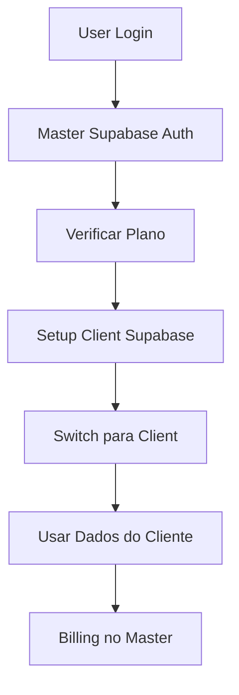

# 🚀 GUIA COMPLETO DE SETUP - Tomik CRM SaaS

## 🎯 VISÃO GERAL

Sistema **SaaS híbrido** com:
- 🏢 **Master Supabase**: Auth, billing, planos (NOSSO)
- 🏥 **Client Supabase**: Dados CRM, agenda, etc. (DO CLIENTE)

## 📋 SETUP PASSO A PASSO

### **PASSO 1: Criar Master Supabase** 🏢

1. **Criar projeto** no Supabase para o Master
2. **Executar SQLs** na pasta `master-migrations/`:
   ```bash
   # No SQL Editor do Supabase Master:
   01-master-extensions.sql
   02-master-plans.sql
   03-master-organizations.sql
   04-master-users.sql
   05-master-sessions.sql
   06-master-functions.sql
   ```

3. **Configurar variáveis** no `.env`:
   ```
   VITE_MASTER_SUPABASE_URL=https://seu-master.supabase.co
   VITE_MASTER_SUPABASE_ANON_KEY=sua_chave_master
   ```

### **PASSO 2: Preparar Client SQLs** 🏥

1. **Fornecer para clientes** a pasta `client-migrations/`
2. **Documentação** em `CLIENT-SQL-SETUP.md`
3. **Ordem de execução** é crítica!

### **PASSO 3: Testar Fluxo Completo** 🧪

1. **Acessar app** → Tela de login do Master
2. **Criar conta** → Signup no nosso sistema
3. **Configurar Supabase** → Cliente conecta seu Supabase
4. **Usar sistema** → Dados no Supabase do cliente

## 🔄 FLUXO DE DADOS



## 🛡️ SEGURANÇA

### **Master Supabase:**
- ✅ **Credenciais criptografadas** do cliente
- ✅ **JWT tokens** seguros
- ✅ **RLS policies** por organização
- ✅ **Audit logs** completos

### **Client Supabase:**
- ✅ **Dados isolados** por organização
- ✅ **RLS policies** robustas
- ✅ **Triggers** para integridade
- ✅ **Backup automático**

## 📊 FUNCIONALIDADES

### **✅ IMPLEMENTADAS:**
- 🔐 **Auth centralizado** no Master
- 💳 **Sistema de planos** e billing
- 🏥 **CRM completo** no Client
- 📅 **Agenda visual** com drag & drop
- 💰 **Sistema financeiro** completo
- 🤖 **Integrações IA** e n8n
- 📊 **Relatórios** avançados
- 🔔 **Notificações** em tempo real

### **🔄 SINCRONIZAÇÕES:**
- ✅ **Agendamento** → **Consulta** (automático)
- ✅ **Consulta** → **Estatísticas** (tempo real)
- ✅ **Lead** → **Atividades** (log completo)
- ✅ **Pagamento** → **Relatórios** (instantâneo)

## 🎯 VANTAGENS

### **PARA O NEGÓCIO:**
- 💰 **Monetização** via planos
- 📈 **Escalabilidade** infinita
- 🛡️ **Compliance** LGPD
- 🎯 **Controle total** de usuários

### **PARA O CLIENTE:**
- 🔒 **Dados privados** no seu Supabase
- ⚡ **Performance** otimizada
- 🔧 **Customização** completa
- 📊 **Relatórios** detalhados

## 🚨 PONTOS CRÍTICOS

### **⚠️ CUIDADOS:**
- 🔑 **Credenciais Master** devem estar seguras
- 🔄 **Ordem dos SQLs** é obrigatória
- 🛡️ **RLS policies** devem estar ativas
- 💾 **Backup** do Master é crítico

### **🔧 TROUBLESHOOTING:**
- ❌ **Erro de conexão**: Verificar variáveis de ambiente
- ❌ **RLS bloqueando**: Usar políticas "Dev" temporariamente
- ❌ **Triggers falhando**: Verificar dependências entre tabelas
- ❌ **Auth falhando**: Verificar funções do Master

## 🎉 RESULTADO FINAL

**Sistema SaaS profissional** com:
- ✅ **Multi-tenancy** real
- ✅ **Billing integrado**
- ✅ **Dados isolados**
- ✅ **Escalabilidade** empresarial
- ✅ **UX premium**

**PRONTO PARA PRODUÇÃO!** 🚀